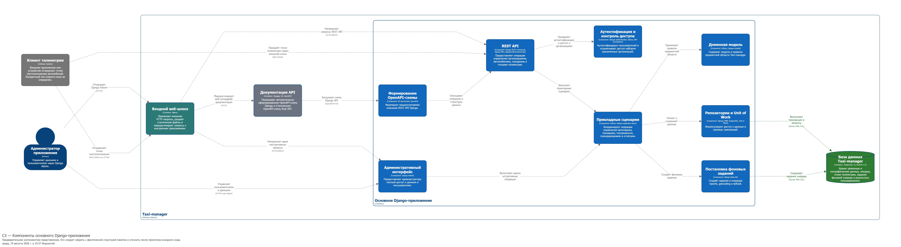
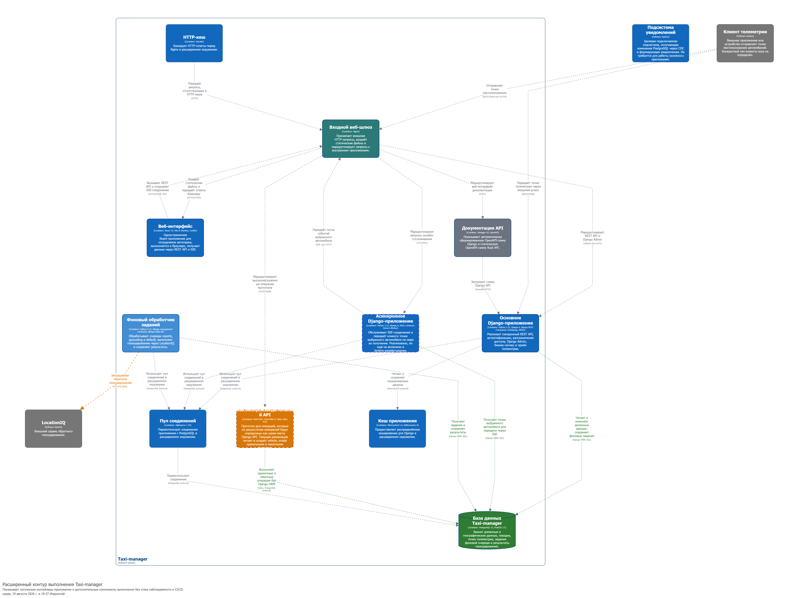
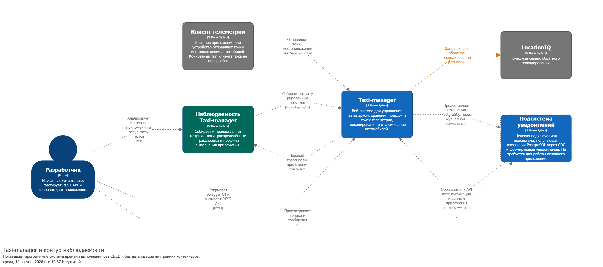
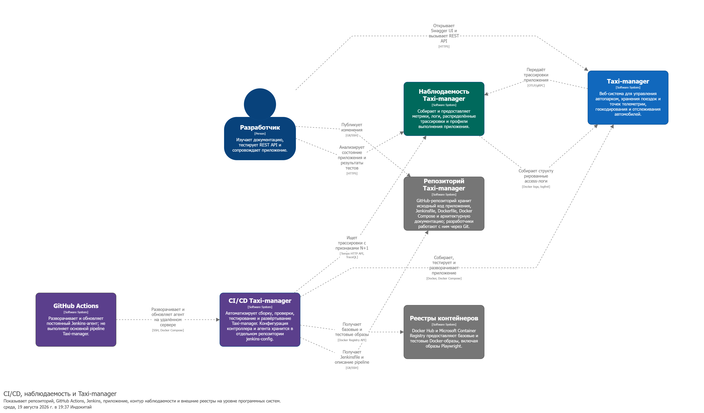
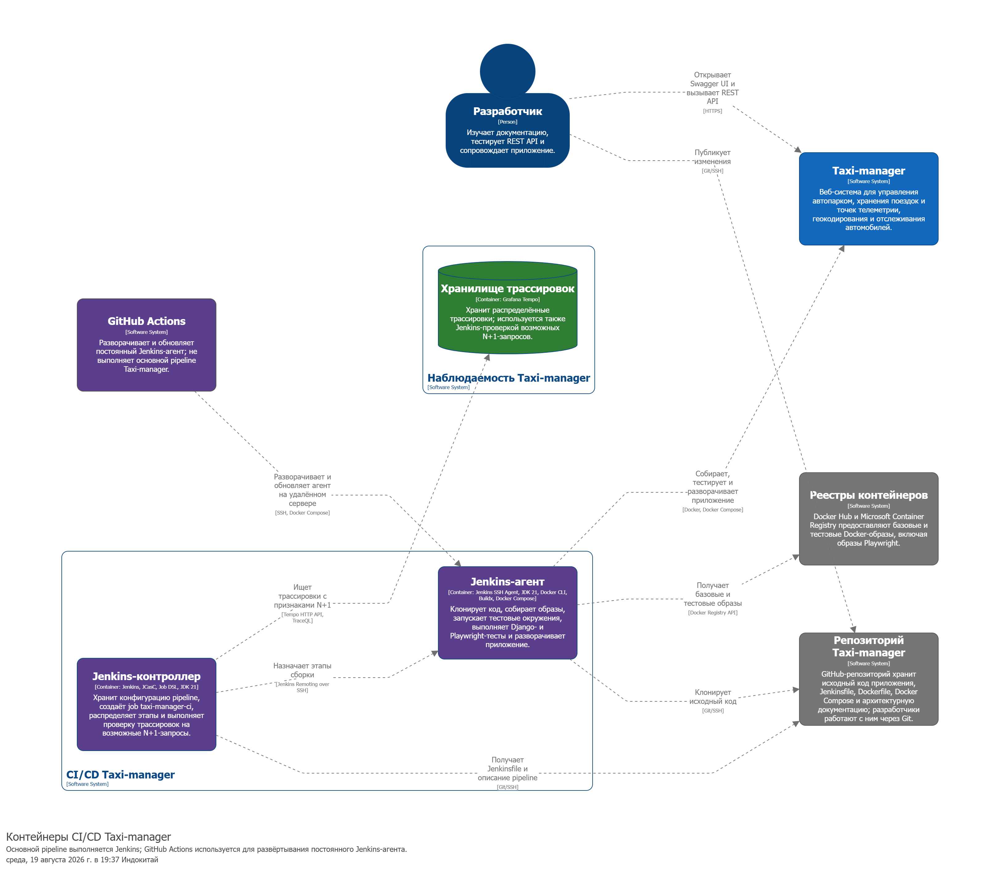
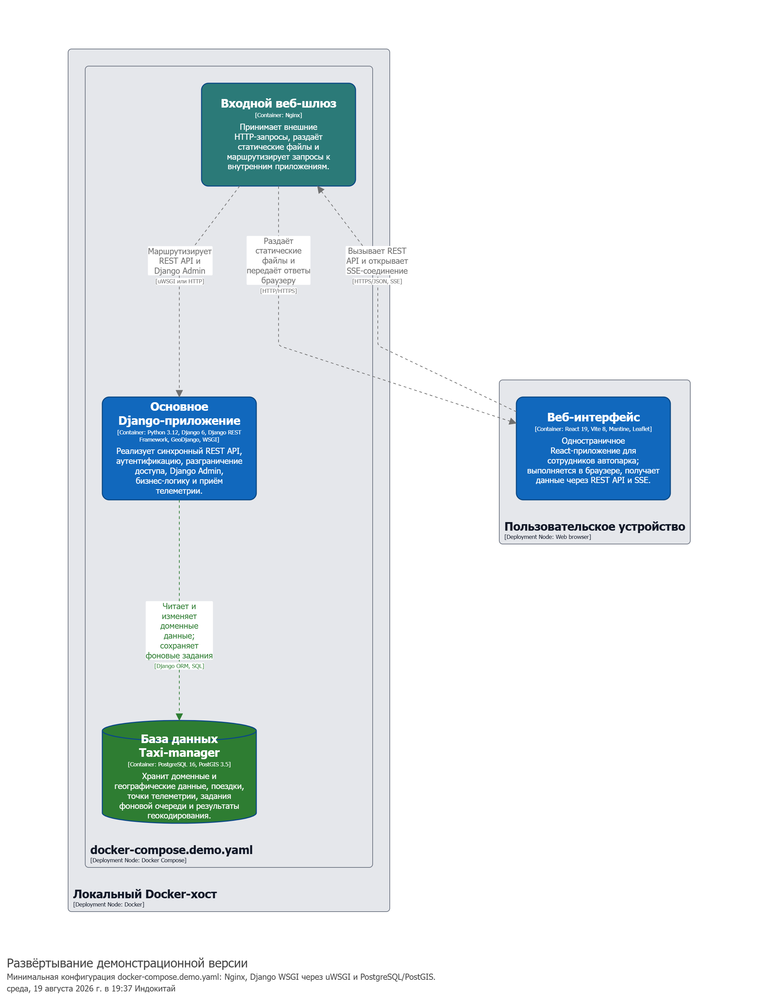
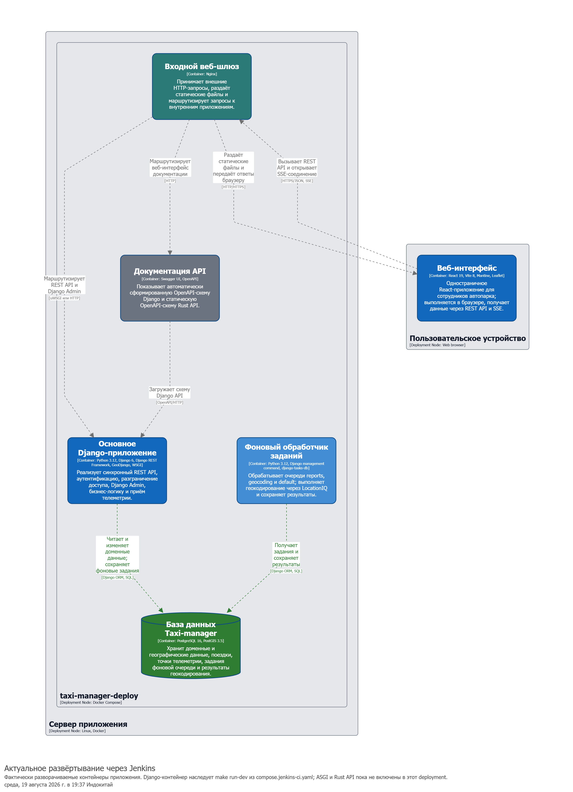
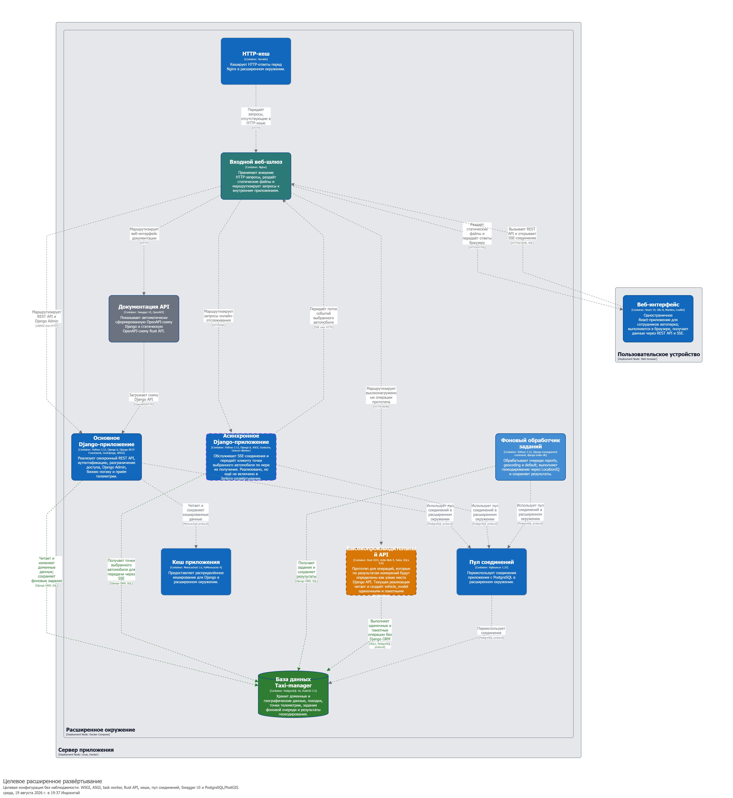

## О проекте

Taxi-manager (автопарк) — веб-приложение для управления автопарками нескольких
организаций. Система позволяет вести учёт автомобилей и водителей,
просматривать поездки и их маршруты на карте, а также отслеживать
движение автомобилей по мере поступления телеметрии.

## Ключевые возможности

Доступ к данным разграничивается на уровне организаций. Сотрудник
автопарка работает только с организациями, назначенными его учётной
записи. В текущей версии права менеджера и диспетчера не разделяются.

При обращении к защищённым разделам неаутентифицированный пользователь
перенаправляется на страницу входа.

Сотрудник автопарка может:

- просматривать, добавлять, изменять и удалять автомобили доступных ему
  организаций;
- изменять принадлежность автомобиля к организации в пределах своих
  прав доступа;
- просматривать завершённые поездки и построенные по точкам
  местоположения маршруты;
- наблюдать за маршрутом активной поездки по мере поступления новых
  точек телеметрии.

Точки местоположения поступают от внешнего клиента телеметрии через
REST API. Обновления активного трека передаются в веб-интерфейс через
SSE и отображаются на карте.

Для каждой организации может быть задан собственный часовой пояс.
REST API возвращает значения даты и времени в формате ISO 8601 с явным
указанием часового смещения.


## Роли и разграничение доступа

Права пользователя определяются его ролью в организации (менеджер/диспетчер или администратор) и набором назначенных ему организаций. Роль определяет доступные операции, а назначение организаций ограничивает область данных, с которой пользователь может работать. Проверка доступа выполняется на стороне REST API.

<details>
<summary><strong>Неаутентифицированный пользователь</strong></summary>

При попытке открыть защищённый раздел неаутентифицированный пользователь перенаправляется на страницу входа.

</details>

<details>
<summary><strong>Сотрудник автопарка</strong></summary>

В текущей версии менеджер и диспетчер представлены единой ролью — **«Сотрудник автопарка»**. Различий в их правах доступа пока нет.

Администратор может назначить сотруднику одну или несколько организаций. Одна организация может быть назначена нескольким сотрудникам.

В пределах назначенных организаций сотрудник может:

- просматривать и изменять сведения об организациях;
    
- просматривать, добавлять, изменять и удалять автомобили;
    
- переносить автомобиль между доступными ему организациями;
    
- просматривать поездки и построенные по точкам местоположения маршруты;
    
- отслеживать маршрут активной поездки по мере поступления телеметрии.
    

Сотрудник может удалить организацию только при одновременном выполнении следующих условий:

- он является единственным сотрудником, которому назначена организация;
    
- в организации нет назначенных автомобилей;
    
- в организации нет назначенных водителей.
    

Сотрудник не может:

- создавать организации;
    
- управлять пользователями;
    
- назначать организации другим пользователям;
    
- просматривать или изменять данные водителей через пользовательский веб-интерфейс.
    

</details>

<details>
<summary><strong>Администратор приложения</strong></summary>

Администратор имеет полный доступ ко всем данным и пользователям через Django Admin. Он может:

- создавать организации;
    
- создавать пользователей и управлять их учётными записями;
    
- назначать сотрудникам одну или несколько организаций;
    
- управлять автомобилями, водителями, поездками и другими данными независимо от организации.
    

Ограничение по назначенным организациям на администратора не распространяется.

</details>

<details>
<summary><strong>Водитель</strong></summary>

В текущей версии водитель не является пользователем приложения и не имеет доступа к веб-интерфейсу. Водители существуют только как учётные записи предметной области и управляются администратором либо создаются при загрузке демонстрационных данных.

Добавление отдельной роли водителя и собственного пользовательского интерфейса планируется в дальнейшем.

</details>

<details>
<summary><strong>Разработчик и клиент телеметрии</strong></summary>

Разработчик не является эксплуатационной ролью системы. Во время разработки он может использовать Django Admin и средства документирования и тестирования REST API.

Клиент телеметрии является внешней технической системой, а не пользовательской ролью. Он отправляет точки местоположения автомобилей через REST API. Механизм его аутентификации и разграничения доступа требует отдельного описания после реализации и проверки.

</details>

## Пользовательский интерфейс

Основной пользовательский интерфейс предназначен для сотрудников автопарка. В интерфейсе организации, доступные пользователю, называются **предприятиями**.

<details>
<summary><strong>Вход в систему</strong></summary>

Для доступа к основным функциям пользователь должен пройти аутентификацию, указав имя пользователя и пароль. При обращении к защищённым страницам неаутентифицированный пользователь перенаправляется на форму входа.


</details>

<details>
<summary><strong>Список предприятий</strong></summary>

После успешной аутентификации в разделе **«Предприятия»** отображаются предприятия, назначенные учётной записи сотрудника.

Для каждого предприятия доступны:

- переход к карточке предприятия;
    
- просмотр списка автомобилей;
    
- экспорт поездок;
    
- импорт поездок.
    

Ограничение доступа к предприятиям и связанным с ними данным проверяется на стороне REST API.


</details>

<details>
<summary><strong>Карточка предприятия</strong></summary>

В карточке предприятия можно изменить его наименование, город и часовой пояс. Каждое предприятие может использовать собственный часовой пояс.

Удаление предприятия доступно только при выполнении ограничений, описанных в разделе «Роли и разграничение доступа».


</details>

<details>
<summary><strong>Автомобили предприятия</strong></summary>

Для каждого предприятия доступен список принадлежащих ему автомобилей. В таблице отображаются основные сведения об автомобилях, включая марку, год выпуска, цену, регистрационный номер и VIN.

Из списка можно перейти к редактированию автомобиля или открыть страницу отслеживания его текущего местоположения.


</details>

<details>
<summary><strong>Карточка автомобиля</strong></summary>

В карточке автомобиля можно изменить:

- предприятие, которому принадлежит автомобиль;
    
- марку;
    
- регистрационный номер;
    
- пробег;
    
- цену;
    
- VIN;
    
- год выпуска;
    
- дату приобретения.
    

Из карточки также можно перейти к истории поездок автомобиля, сохранить внесённые изменения или удалить автомобиль.


</details>

<details>
<summary><strong>Отслеживание автомобиля</strong></summary>

Ссылка **«Отслеживать»** из списка автомобилей открывает страницу текущего маршрута автомобиля. Трек обновляется по мере поступления новых точек местоположения от внешнего клиента телеметрии.

</details>

<details>
<summary><strong>Поездки и маршруты</strong></summary>

Ссылка **«Маршруты»** в карточке автомобиля открывает историю его поездок. Пользователь может выбрать период, после чего система отображает найденные поездки на карте и в таблице.

Для каждой поездки показываются:

- время начала и окончания;
    
- адрес начала и окончания;
    
- маршрут, построенный по последовательности точек местоположения.
    

Адреса начала и окончания поездок определяются по географическим координатам с помощью обратного геокодирования во внешнем сервисе [LocationIQ](https://locationiq.com/).


</details>

## Архитектура, интерфейсы и технологический стек

Архитектура Taxi-manager описана набором взаимодополняющих представлений C4. Основным считается логическое представление: оно показывает назначение контейнеров и связи между ними независимо от конкретного способа развёртывания. Схемы развёртывания, наблюдаемости, CI/CD и целевой подсистемы уведомлений вынесены отдельно, чтобы не смешивать работающую часть приложения с прототипами и планируемыми расширениями.

Исходный код моделей хранится в [`docs/architecture`](docs/architecture/), точка входа — [`workspace.dsl`](docs/architecture/workspace.dsl). PNG-версии представлений экспортируются в `docs/images/c4/`. Имя PNG совпадает с ключом соответствующего Structurizr view, поэтому ссылки из README не требуется изменять после повторной генерации схем.

### Статус архитектурных элементов

| Статус | Значение | Примеры |
| --- | --- | --- |
| **Текущий** | Реализован и входит в действующий контур приложения | React UI, Nginx, Django WSGI, task worker, PostgreSQL/PostGIS, Swagger UI |
| **Реализован, не включён в Jenkins deployment** | Работает в расширенном локальном окружении, но пока отсутствует в актуальном Jenkins-развёртывании | Django ASGI и передача данных через SSE |
| **Прототип** | Можно запустить отдельно, однако основной пользовательский поток его пока не использует | Rust API |
| **Целевой, подключаемый** | Предусмотрен целевой архитектурой и может быть включён при необходимости | сервис уведомлений, Debezium, Kafka; часть компонентов кеширования |
| **Эксперимент** | Используется для проверки технологии и не является обязательной частью системы | Flink/Flink SQL, отдельное Cypress-окружение |

Статусы зафиксированы непосредственно в C4-модели и визуально различаются стилем границ и цветом элементов.

### Контекст системы

Taxi-manager используется сотрудником автопарка и администратором приложения. Точки местоположения поступают от внешнего клиента телеметрии. Для обратного геокодирования система обращается к LocationIQ. Подсистема уведомлений показана как целевая подключаемая система и не требуется для запуска основного приложения.


### Основная логическая архитектура


Основной функциональный контур образуют:

| Контейнер | Ответственность | Текущий статус |
| --- | --- | --- |
| **Веб-интерфейс** | Пользовательский интерфейс, работа с REST API, отображение карт и получение онлайн-обновлений | текущий |
| **Nginx** | Единая HTTP-точка входа, раздача статических файлов и маршрутизация запросов | текущий |
| **Django WSGI** | Синхронный REST API, аутентификация, разграничение доступа, Django Admin и основная бизнес-логика | текущий |
| **Django ASGI** | Длительные SSE-соединения и передача точек выбранного автомобиля | реализован, пока не включён в Jenkins deployment |
| **Task worker** | Обработка очередей `reports`, `geocoding` и `default`, включая обращения к LocationIQ | текущий |
| **Rust API** | Прототип переноса операций, которые измерения производительности определят как узкие места Django | прототип, не используется основным приложением |
| **PostgreSQL/PostGIS** | Доменные, географические и служебные данные, точки телеметрии и задания фоновой очереди | текущий |
| **Swagger UI** | Просмотр OpenAPI-схем Django REST API и Rust API | текущий |
| **Подсистема уведомлений** | Получение изменений PostgreSQL через CDC и формирование уведомлений | целевая, подключаемая |

Логическое представление намеренно не фиксирует один WSGI-сервер. В демонстрационном и расширенном локальном Compose-профилях WSGI-приложение запускается через uWSGI. В `Makefile` также определён запуск через Gunicorn. ASGI-приложение запускается Gunicorn с `uvicorn-worker`. Актуальный Jenkins deployment наследует `make run-dev` из `compose.jenkins-ci.yaml`, то есть сейчас использует Django development server; это отражено на отдельной схеме развёртывания как текущее состояние, а не как целевая production-конфигурация.

### Интерфейсы системы

| Интерфейс | Назначение | Реализация |
| --- | --- | --- |
| **REST API** | Управление организациями, автомобилями, поездками и телеметрией; синхронные операции | Django REST Framework через WSGI |
| **SSE** | Однонаправленная передача новых точек выбранного автомобиля в браузер | Django ASGI, `text/event-stream` |
| **OpenAPI** | Машиночитаемый контракт REST API | `drf-spectacular` для Django; отдельная статическая схема для Rust API |
| **Swagger UI** | Интерактивный просмотр и ручная проверка OpenAPI-описаний | отдельный контейнер `swaggerapi/swagger-ui` |

OpenAPI является описанием интерфейса, а Swagger UI — пользовательским инструментом отображения этого описания; поэтому на C4-схеме они показаны раздельно.

### Ключевые сценарии взаимодействия

При онлайн-отслеживании браузер открывает SSE-соединение для выбранного автомобиля. Nginx направляет его в ASGI-приложение, которое читает доступные точки и начинает передавать события клиенту. Новые точки поступают через REST API WSGI-приложения и сохраняются в PostgreSQL. Конкретный механизм обнаружения ASGI-приложением очередной записи необходимо окончательно сверить с реализацией endpoint; схема фиксирует подтверждённый внешний контракт, не предполагая неподтверждённую внутреннюю технологию.


<details>
<summary>Фоновое обратное геокодирование</summary>

WSGI-приложение сохраняет фоновое задание в базе данных. Task worker получает его, обращается к LocationIQ и сохраняет результат. Внешний сервис не имеет прямого доступа к PostgreSQL.


</details>

### Компоненты основного Django-приложения

Компонентная схема является предварительной. Она показывает предполагаемое разделение на REST API, контроль доступа, Django Admin, прикладные сценарии, доменную модель, репозитории, постановку фоновых заданий и формирование OpenAPI-схемы. Перед тем как считать C3-представление окончательным, его следует сверить с реальными границами Python-пакетов и направлением зависимостей в исходном коде.



### Целевая подсистема уведомлений

Подсистема уведомлений отделена от основного приложения: тяжёлый событийный стек не нужен для базового запуска Taxi-manager. Целевой поток имеет вид `PostgreSQL → Debezium → Kafka → сервис уведомлений`. Сервис может обращаться к REST API Taxi-manager и хранит собственное состояние в SQLite. Flink/Flink SQL остаётся самостоятельным учебным экспериментом.


<details>
<summary>Дополнительные архитектурные представления</summary>

#### Расширенный runtime без наблюдаемости

Схема дополняет основной логический контур PgBouncer, Memcached и Varnish. Эти компоненты присутствуют не во всех профилях и не нужны для минимальной демо-версии.



#### Наблюдаемость

Первое представление показывает границы Taxi-manager и подсистемы наблюдаемости на уровне программных систем, второе — поток метрик, логов, трассировок и профилей между контейнерами.




#### CI/CD и наблюдаемость

Основной CI/CD-контур построен на Jenkins. Контроллер назначает этапы постоянному SSH-агенту; агент собирает образы, запускает проверки и тесты и выполняет Compose-развёртывание. Jenkins использует трассировки Tempo для поиска возможных N+1-запросов. GitHub Actions разворачивает и обновляет Jenkins-агент, но не заменяет основной pipeline.

Конфигурация Jenkins-контроллера и агента хранится в отдельном репозитории [`jenkins-config`](https://github.com/metacortex687/jenkins-config).






#### Варианты развёртывания

Схемы развёртывания не заменяют логическую архитектуру: они показывают, какие контейнеры включены в конкретное окружение.







</details>

### Технологический стек основного приложения

| Область | Основные технологии |
| --- | --- |
| **Backend** | Python 3.12, Django 6.0, Django REST Framework 3.16, GeoDjango, Django ORM |
| **Frontend** | React 19, Vite 8, Mantine 9, TanStack Query 5, React Router 7, Leaflet/React Leaflet |
| **Данные и география** | PostgreSQL 16, PostGIS 3.5, GDAL, GEOS, PROJ, geopy, OSMnx, NetworkX |
| **Процессы приложения** | WSGI, ASGI, SSE, task worker на `django-tasks-db` |
| **Веб-контур** | Nginx, uWSGI, Gunicorn, Uvicorn Worker, WhiteNoise |
| **Интерфейсы и документация** | REST, OpenAPI, `drf-spectacular`, Swagger UI |
| **Сборка и запуск** | `uv`, npm, Make, Docker, Docker Compose |

<details>
<summary>Полный перечень технологий по назначению</summary>

#### Backend и REST API

- Python 3.12;
- Django 6.0: веб-фреймворк, ORM, миграции, аутентификация и Django Admin;
- Django REST Framework 3.16.1;
- GeoDjango и `djangorestframework-gis` 1.2;
- Djoser 2.3.3;
- `django-filter` 25.2;
- `drf-spectacular` 0.30 и OpenAPI;
- `django-import-export` 4.4;
- `django-tasks-db` 0.12;
- fpdf2 2.8;
- Faker 40.4;
- `dj-database-url` 3.1;
- `psycopg2-binary` 2.9;
- WhiteNoise 6.12;
- `django-bootstrap5` 26.2;
- `uv` и `uv.lock` для воспроизводимого управления Python-зависимостями.

#### Географические данные

- PostgreSQL 16 и PostGIS 3.5;
- GDAL, GEOS и PROJ;
- geopy 2.4;
- OSMnx 2.1;
- NetworkX 3.6;
- внешний сервис обратного геокодирования LocationIQ;
- Leaflet 1.9 и React Leaflet 5 для отображения карт.

#### Пользовательский интерфейс

- Node.js 22 на этапе Docker-сборки;
- React 19.2 и React DOM 19.2;
- Vite 8 и `@vitejs/plugin-react` 6;
- Mantine 9;
- Bootstrap 5.3 и React Bootstrap 2.10;
- TanStack React Query 5.99;
- React Router 7.14;
- Day.js 1.11;
- React Hot Toast 2.6;
- npm и `package-lock.json`.

#### Серверы и инфраструктура выполнения

- Nginx;
- uWSGI 2.0;
- Gunicorn 25.3;
- Uvicorn 0.49 и `uvicorn-worker` 0.4 для ASGI;
- Django development server для локальной разработки, CI и текущего Jenkins deployment;
- Docker и Docker Compose;
- PgBouncer 1.25 в режиме транзакций;
- Memcached 1.6 и PyMemcache 4;
- Varnish;
- Swagger UI;
- Make.

#### Прототип производительного API

- Rust edition 2021;
- Actix Web 4;
- Tokio 1;
- SQLx 0.8 с PostgreSQL и Rustls;
- Serde и Serde JSON;
- `env_logger` и `log`.

Rust API обращается к PostgreSQL напрямую. Решение о переносе конкретных операций принимается только по результатам нагрузочных измерений и поиска узких мест; основной поток приложения сервис пока не использует.

#### Целевая событийная подсистема и уведомления

- Apache Kafka 4.3 в режиме KRaft;
- Kafka Connect;
- Debezium 3.6 и логическая репликация PostgreSQL;
- Kafka UI;
- JSON-сериализация событий;
- сервис уведомлений на Python 3.13 с `uv`, Kafka-клиентом и SQLite;
- Apache Flink и Flink SQL — отдельный учебный эксперимент.

Старый VK-бот исключён из актуальной архитектуры. Пока очистка исходного кода не завершена, в `pyproject.toml` ещё могут присутствовать переходные зависимости `vk-api` и `django-pgwatch`; они не считаются частью целевого стека.

#### Наблюдаемость и производительность

- OpenTelemetry SDK и автоматическая инструментация Django, WSGI, ASGI, PostgreSQL, Memcached и HTTP-клиентов;
- OTLP over gRPC, W3C Trace Context и Baggage;
- Grafana Alloy;
- Prometheus и `django-prometheus`;
- Grafana Loki;
- Grafana Tempo и TraceQL;
- Grafana Pyroscope и `pyroscope-io`;
- Grafana;
- cAdvisor;
- Nginx Prometheus Exporter;
- Varnish exporter;
- GoAccess;
- k6 и Prometheus Remote Write;
- Django Debug Toolbar и Django Silk.

#### Тестирование и CI/CD

- Django Test Framework;
- pytest 9 и pytest-django 4;
- Ruff 0.14;
- `unittest-xml-reporting` и JUnit XML;
- Playwright 1.61 — актуальные E2E-тесты Jenkins pipeline;
- Cypress 15 — отдельный учебный эксперимент с SQLite и SpatiaLite;
- Jenkins Pipeline, Jenkins Configuration as Code и Job DSL;
- Jenkins controller и постоянный SSH agent на JDK 21;
- Docker CLI, Docker Buildx и Docker Compose на Jenkins-агенте;
- GitHub Actions — только доставка Jenkins-агента;
- Git, GitHub, Docker Hub и Microsoft Container Registry.

#### Архитектурная документация

- C4 Model;
- Structurizr DSL;
- ADR для значимых архитектурных решений.

Эти инструменты документируют систему и не являются частью её runtime-стека.

</details>

### Источники и границы достоверности

Полный состав и точные версии зависимостей следует проверять по исходным файлам, а не по этому обзорному списку:

- [`pyproject.toml`](pyproject.toml) и [`uv.lock`](uv.lock);
- [`package.json`](taxi_manager/infrastructure/react_frontend/package.json) и [`package-lock.json`](taxi_manager/infrastructure/react_frontend/package-lock.json);
- [`rust-api/Cargo.toml`](rust-api/Cargo.toml);
- [`Makefile`](Makefile);
- [`Jenkinsfile`](Jenkinsfile) и Docker Compose-файлы;
- [`docs/architecture/workspace.dsl`](docs/architecture/workspace.dsl).

Архитектурная документация фиксирует несколько состояний системы одновременно, но не выдаёт планы за уже развёрнутую функциональность. При изменении кода сначала обновляются манифесты и модель, затем повторно экспортируются PNG. Требуют дополнительной сверки по коду: внутренние границы C3-компонентов и механизм, с помощью которого ASGI endpoint обнаруживает появление новой точки телеметрии.


## Быстрый запуск демо-версии

### Требования

Для запуска необходимы:

- Git;
    
- Docker Engine или Docker Desktop;
    
- Docker Compose версии 2.
    

Проверить доступность Docker можно командами:

```bash
docker version
docker compose version
```

### Клонирование репозитория

```bash
git clone https://github.com/metacortex687/taxi-manager.git
cd taxi-manager
```

### Настройка переменных окружения

Создайте файл `.env` на основе примера:

```bash
cp .env.example .env
```

При необходимости измените параметры подключения к PostgreSQL, секретный ключ Django, данные администратора и API-ключ LocationIQ:

```env
LOCATIONIQ_KEY=your-locationiq-key

POSTGRES_USER=taxi_manager
POSTGRES_PASSWORD=secret
POSTGRES_DB=taxi_manager

DJANGO_SECRET_KEY=change-me

DJANGO_SUPERUSER_NAME=admin
DJANGO_SUPERUSER_PASSWORD=admin
DJANGO_SUPERUSER_EMAIL=admin@example.com
```

Указанные значения предназначены только для локального демонстрационного запуска. При развёртывании приложения на доступном извне сервере необходимо использовать собственные стойкие пароли и секретный ключ.

### Запуск приложения

```bash
docker compose -f docker-compose.demo.yaml up -d --build
```

При первом запуске Docker соберёт образ приложения, создаст базу данных, применит миграции и загрузит демонстрационные данные.

Состояние контейнеров можно проверить командой:

```bash
docker compose -f docker-compose.demo.yaml ps
```

Для просмотра процесса запуска приложения:

```bash
docker compose -f docker-compose.demo.yaml logs -f taxi-manager
```

После запуска пользовательский интерфейс будет доступен по адресу:

```text
http://localhost/
```

### Остановка приложения

```bash
docker compose -f docker-compose.demo.yaml down
```

Повторный запуск выполняется без пересоздания базы данных:

```bash
docker compose -f docker-compose.demo.yaml up -d
```

## 7. Демонстрационные данные

<details>
<summary><strong>Состав данных, учётные записи и пересоздание базы</strong></summary>

При запуске контейнера приложения последовательно выполняются:

```text
make migrate
make ensure-superuser
make ensure-demo-data
make run-uwsgi
```

Команда `ensure-demo-data` обеспечивает наличие демонстрационных организаций, автомобилей, водителей, поездок и других данных, необходимых для ознакомления с возможностями приложения.

Для входа в пользовательский интерфейс можно использовать следующие учётные записи:

|Пользователь|Пароль|
|---|---|
|`manager1`|`manager1`|
|`manager2`|`manager2`|

Учётная запись администратора Django создаётся из параметров `DJANGO_SUPERUSER_NAME`, `DJANGO_SUPERUSER_PASSWORD` и `DJANGO_SUPERUSER_EMAIL`, указанных в файле `.env`.

Повторно выполнить проверку и загрузку демонстрационных данных можно командой:

```bash
docker compose -f docker-compose.demo.yaml exec taxi-manager make ensure-demo-data
```

### Полное пересоздание демонстрационной базы

Чтобы удалить существующую базу данных и создать её заново:

```bash
docker compose -f docker-compose.demo.yaml down -v
docker compose -f docker-compose.demo.yaml up -d --build
```

> Команда `down -v` удаляет Docker-том с базой данных. Все изменения, внесённые после запуска демонстрационной версии, будут потеряны.

</details>

## CI/CD

Основной CI/CD-конвейер проекта реализован с помощью Jenkins и распределён между двумя репозиториями.

<details>
<summary><strong>Репозитории и схема работы Jenkins</strong></summary>

В репозитории Taxi Manager находятся:

- исходный код приложения;
    
- файл [`Jenkinsfile`](https://chatgpt.com/g/g-p-6863b49bdfb0819187089126f0eb89ee-shkola/c/Jenkinsfile) с описанием конвейера;
    
- конфигурация тестового окружения [`compose.jenkins-ci.yaml`](https://chatgpt.com/g/g-p-6863b49bdfb0819187089126f0eb89ee-shkola/c/compose.jenkins-ci.yaml);
    
- конфигурация развёртывания [`compose.deploy.yaml`](https://chatgpt.com/g/g-p-6863b49bdfb0819187089126f0eb89ee-shkola/c/compose.deploy.yaml).
    

Инфраструктура Jenkins находится в отдельном репозитории [metacortex687/jenkins-config](https://github.com/metacortex687/jenkins-config).

Этот репозиторий содержит:

- конфигурацию Jenkins-контроллера;
    
- Jenkins Configuration as Code;
    
- описание заданий с помощью Job DSL;
    
- конфигурацию постоянного Jenkins-агента;
    
- GitHub Actions workflow для развёртывания и обновления агента.
    

При запуске контроллера автоматически создаётся задание `taxi-manager-ci`, которое получает `Jenkinsfile` из репозитория Taxi Manager. Контроллер подключается к агенту по SSH, после чего агент выполняет основные этапы сборки, тестирования и развёртывания приложения.

GitHub Actions не разворачивает Taxi Manager непосредственно: он используется для доставки и запуска Jenkins-агента. Основной конвейер приложения выполняется Jenkins.

</details>
