# Taxi-manager

## О проекте

Приложение Taxi-manager (автопарк) предназначено для управления автопарками нескольких
организаций. Оно позволяет вести учёт автомобилей и водителей,
просматривать поездки и их маршруты на карте, а также отслеживать
движение автомобилей по мере поступления телеметрии и формировать отчёты.

## Ключевые возможности

Доступ к данным разграничивается на уровне организаций. Сотрудник
автопарка работает только с организациями, назначенными его учётной
записи. В текущей версии права менеджера и диспетчера не разделяются.

При обращении к защищённым разделам неаутентифицированный пользователь
перенаправляется на страницу входа.

Сотрудник автопарка может:

- просматривать, добавлять, изменять и удалять автомобили доступных ему
  организаций;
- изменять принадлежность автомобиля к организации в пределах своих
  прав доступа;
- просматривать завершённые поездки и построенные по точкам
  местоположения маршруты;
- наблюдать за маршрутом активной поездки по мере поступления новых
  точек телеметрии;
- формировать отчёты о пробеге автомобиля и маршрутах автомобилей;
- сохранять отчёт о пробеге автомобиля в формате PDF.

Точки местоположения поступают от внешнего клиента телеметрии через
REST API. Обновления активного трека передаются в веб-интерфейс через
SSE и отображаются на карте.

Для каждой организации может быть задан собственный часовой пояс.
REST API возвращает значения даты и времени в формате ISO 8601 с явным
указанием часового смещения.


## Пользователи и разграничение доступа

Для сотрудника автопарка область доступных данных определяется назначенными ему организациями; в текущей версии права менеджера и диспетчера не разделяются. Администратор приложения имеет полный доступ через Django Admin и не ограничен назначениями организаций. Проверка доступа к данным сотрудника выполняется на стороне REST API.

### Пользователи приложения

<details>
<summary><strong>Неаутентифицированный пользователь</strong></summary>

При попытке открыть защищённый раздел неаутентифицированный пользователь перенаправляется на страницу входа.

</details>

<details>
<summary><strong>Сотрудник автопарка</strong></summary>

В текущей версии менеджер и диспетчер представлены единой ролью — **«Сотрудник автопарка»**. Различий в их правах доступа пока нет.

Администратор может назначить сотруднику одну или несколько организаций. Одна организация может быть назначена нескольким сотрудникам.

В пределах назначенных организаций сотрудник может:

- просматривать и изменять сведения об организациях;

- просматривать, добавлять, изменять и удалять автомобили;

- переносить автомобиль между доступными ему организациями;

- просматривать поездки и построенные по точкам местоположения маршруты;

- отслеживать маршрут активной поездки по мере поступления телеметрии.

- формировать отчёты о пробеге автомобиля и маршрутах автомобилей; отчёт о пробеге можно сохранить в формате PDF.


Сотрудник может удалить организацию только при одновременном выполнении следующих условий:

- он является единственным сотрудником, которому назначена организация;

- в организации нет назначенных автомобилей;

- в организации нет назначенных водителей.


Сотрудник не может:

- создавать организации;

- управлять пользователями;

- назначать организации другим пользователям;

- просматривать или изменять данные водителей через пользовательский веб-интерфейс.


</details>

<details>
<summary><strong>Администратор приложения</strong></summary>

Администратор имеет полный доступ ко всем данным и пользователям через Django Admin. Он может:

- создавать организации;

- создавать пользователей и управлять их учётными записями;

- назначать сотрудникам одну или несколько организаций;

- управлять автомобилями, водителями, поездками и другими данными независимо от организации.


Ограничение по назначенным организациям на администратора не распространяется.

</details>

### Участники и системы вне пользовательских ролей

<details>
<summary><strong>Специалист сопровождения</strong></summary>

Специалист сопровождения не является пользовательской ролью приложения. Он контролирует техническое состояние приложения с помощью Сервиса хранения и визуализации данных мониторинга и получает email-оповещения при срабатывании правил Grafana.

</details>

<details>
<summary><strong>Водитель</strong></summary>

В текущей версии водитель не является пользователем приложения и не имеет доступа к веб-интерфейсу. Водители существуют только как учётные записи предметной области и управляются администратором либо создаются при загрузке демонстрационных данных.

Добавление отдельной роли водителя и собственного пользовательского интерфейса планируется в дальнейшем.

</details>

<details>
<summary><strong>Разработчик внешних сервисов</strong></summary>

Разработчик внешних сервисов использует опубликованную OpenAPI-документацию и REST API Приложения Taxi-manager для разработки и проверки интеграций. Доступ к Django Admin не относится к этой роли.

</details>

<details>
<summary><strong>Клиент телеметрии</strong></summary>

Клиент телеметрии является внешней технической системой, а не пользовательской ролью. Он отправляет точки местоположения автомобилей через REST API. Механизм его аутентификации и разграничения доступа требует отдельного описания после реализации и проверки.

</details>

## Пользовательский интерфейс

Основной пользовательский интерфейс предназначен для сотрудников автопарка. В интерфейсе организации, доступные пользователю, называются **предприятиями**.

<details>
<summary><strong>Вход в систему</strong></summary>

Для доступа к основным функциям пользователь должен пройти аутентификацию, указав имя пользователя и пароль. При обращении к защищённым страницам неаутентифицированный пользователь перенаправляется на форму входа.

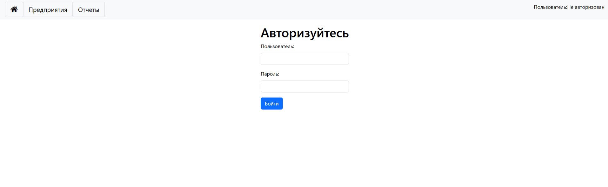

</details>

<details>
<summary><strong>Список предприятий</strong></summary>

После успешной аутентификации в разделе **«Предприятия»** отображаются предприятия, назначенные учётной записи сотрудника.

Для каждого предприятия доступны:

- переход к карточке предприятия;

- просмотр списка автомобилей;

- экспорт поездок;

- импорт поездок.


Ограничение доступа к предприятиям и связанным с ними данным проверяется на стороне REST API.

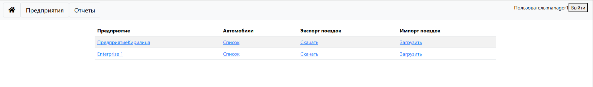

</details>

<details>
<summary><strong>Карточка предприятия</strong></summary>

В карточке предприятия можно изменить его наименование, город и часовой пояс. Каждое предприятие может использовать собственный часовой пояс.

Удаление предприятия доступно только при выполнении ограничений, описанных в разделе «Роли и разграничение доступа».

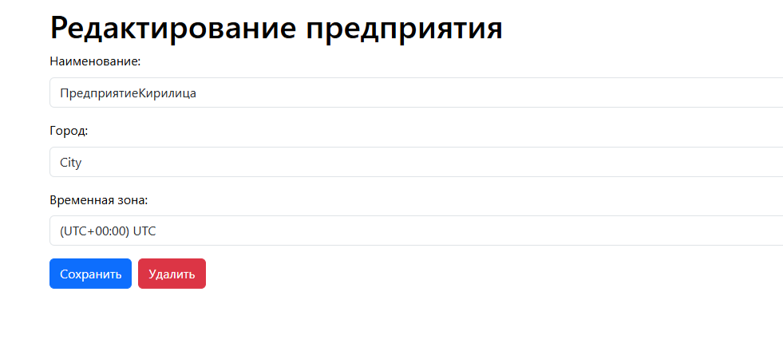

</details>

<details>
<summary><strong>Автомобили предприятия</strong></summary>

Для каждого предприятия доступен список принадлежащих ему автомобилей. В таблице отображаются основные сведения об автомобилях, включая марку, год выпуска, цену, регистрационный номер и VIN.

Из списка можно перейти к редактированию автомобиля или открыть страницу отслеживания его текущего местоположения.

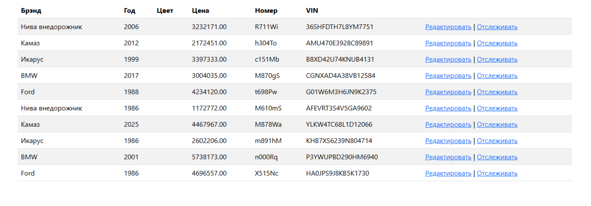

</details>

<details>
<summary><strong>Карточка автомобиля</strong></summary>

В карточке автомобиля можно изменить:

- предприятие, которому принадлежит автомобиль;

- марку;

- регистрационный номер;

- пробег;

- цену;

- VIN;

- год выпуска;

- дату приобретения.


Из карточки также можно перейти к истории поездок автомобиля, сохранить внесённые изменения или удалить автомобиль.

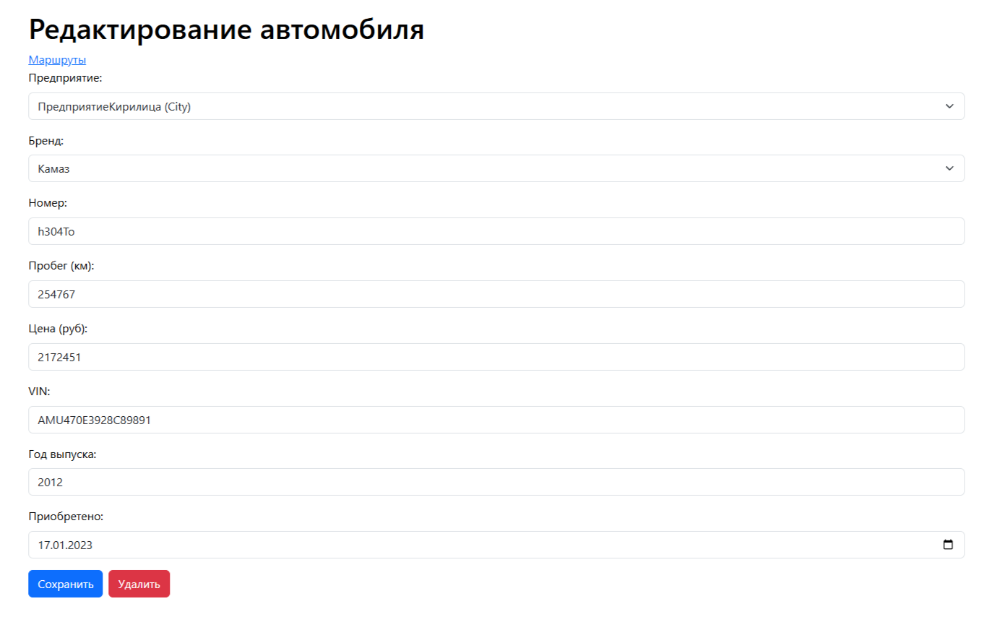

</details>

<details>
<summary><strong>Отслеживание автомобиля</strong></summary>

Ссылка **«Отслеживать»** из списка автомобилей открывает страницу текущего маршрута автомобиля. Трек обновляется по мере поступления новых точек местоположения от внешнего клиента телеметрии.

</details>

<details>
<summary><strong>Поездки и маршруты</strong></summary>

Ссылка **«Маршруты»** в карточке автомобиля открывает историю его поездок. Пользователь может выбрать период, после чего система отображает найденные поездки на карте и в таблице.

Для каждой поездки показываются:

- время начала и окончания;

- адрес начала и окончания;

- маршрут, построенный по последовательности точек местоположения.


Адреса начала и окончания поездок определяются по географическим координатам с помощью обратного геокодирования во внешнем сервисе [LocationIQ](https://locationiq.com/).


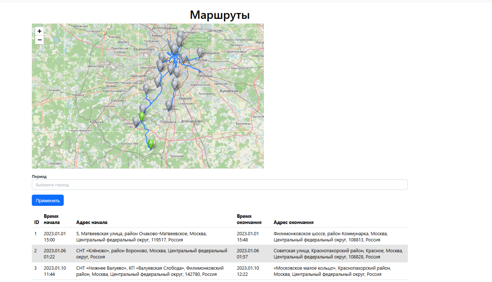

</details>

<details>
<summary><strong>Отчёты</strong></summary>

В разделе **«Отчёты»** сотруднику доступны два вида отчётов:

- **«Пробег автомобиля»** — пробег и количество поездок выбранного автомобиля с группировкой по дням, неделям, месяцам или годам;
- **«Маршруты автомобилей»** — маршруты автомобилей предприятия за выбранный период.

Перечень отчётов может расширяться по мере развития системы.

Отчёты формируются фоновым обработчиком заданий. Результат отображается в веб-интерфейсе. Для отчёта **«Пробег автомобиля»** дополнительно доступно сохранение в формате PDF.

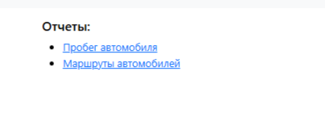

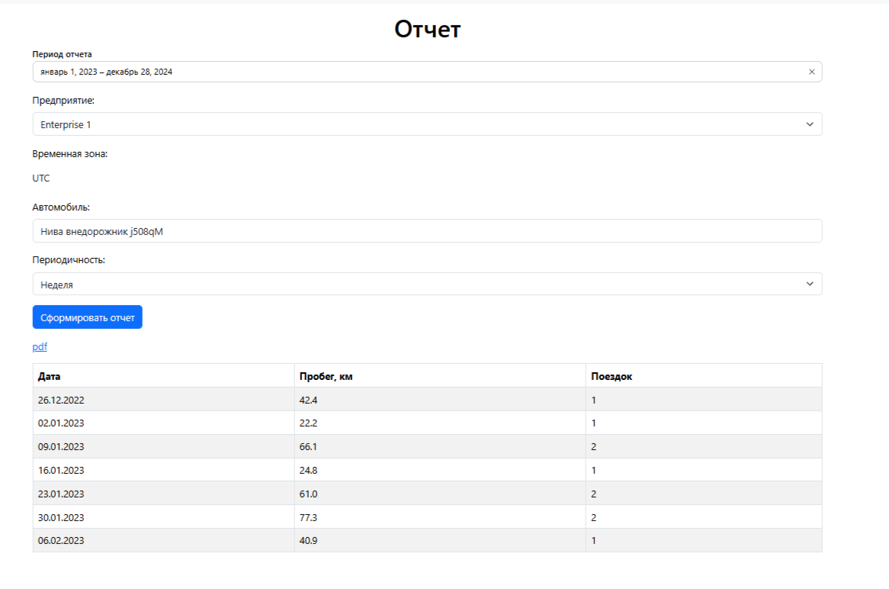

</details>

## Архитектура, интерфейсы и технологический стек

Архитектура приложения описана набором взаимодополняющих представлений модели C4. Основной функциональный контур, Сервис уведомлений менеджеров с Kafka, кэширование, наблюдаемость и CI/CD показаны отдельно и могут рассматриваться совместно для нужной конфигурации.

Исходный код моделей хранится в [`docs/architecture`](docs/architecture/), точка входа — [`workspace.dsl`](docs/architecture/workspace.dsl). PNG-версии представлений экспортируются в `docs/images/c4/`. Имя PNG совпадает с ключом соответствующего Structurizr view.

<details>
<summary><strong>1. Основная логическая архитектура</strong></summary>

### Диаграмма контекста системы

Приложение Taxi-manager используется сотрудником автопарка и администратором приложения. Сотрудник автопарка управляет автопарком, просматривает маршруты и получает сформированные отчёты.

Разработчик внешних сервисов использует опубликованную OpenAPI-документацию и REST API для создания интеграций. Точки местоположения поступают от внешнего клиента телеметрии. Для обратного геокодирования система обращается к LocationIQ.

Приложение Taxi-manager передаёт данные о своей работе в Сервис хранения и визуализации данных мониторинга.

Специалист сопровождения, CI/CD-контур и подключаемый Сервис уведомлений менеджеров вынесены в отдельные представления. Внутренние контейнеры и варианты физического развёртывания на диаграмме контекста системы не показываются.

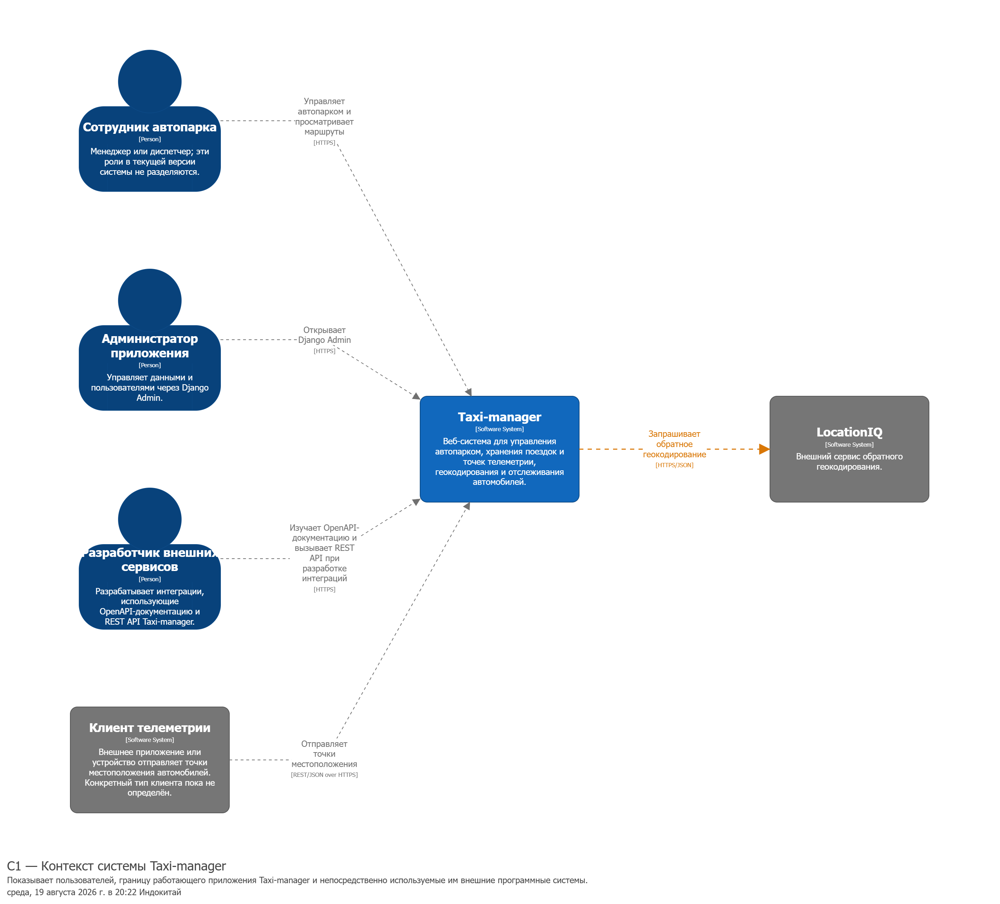

### Диаграмма контейнеров

Основное представление показывает контейнеры нотации C4 и связи между ними. В текущем варианте запуска они в основном соответствуют сервисам Docker Compose, однако это не схема Docker-контейнеров: те же приложения и процессы можно развернуть непосредственно в операционной системе или распределить между узлами.


<details>
<summary><strong>Назначение контейнеров и обоснование выбора технологий</strong></summary>

| Контейнер C4 | Назначение | Технологии и применение | Обоснование выбора |
| --- | --- | --- | --- |
| **Веб-интерфейс** | Работа сотрудника с автопарком, картами, маршрутами, отчётами и онлайн-обновлениями | React 19 и Mantine формируют интерфейс; TanStack Query работает с серверным состоянием; Leaflet отображает геоданные; Vite собирает приложение | React выбран как распространённая технология для создания отдельного интерактивного фронтенда, взаимодействующего с backend через REST API. Серверные шаблоны Django не обеспечивают требуемую интерактивность без значительного объёма дополнительного клиентского кода, а Vanilla JavaScript был бы сложнее в дальнейшем сопровождении, чем готовый фреймворк. |
| **Входной веб-шлюз** | Единая HTTP-точка входа, обслуживание клиентских соединений, раздача статических файлов и маршрутизация запросов | Nginx направляет обычные REST-запросы и Django Admin в Синхронный REST API, асинхронные REST-запросы и онлайн-отслеживание — в Асинхронный REST API и SSE, ресурсоёмкие операции — в Высокопроизводительный асинхронный REST API, а также публикует веб-интерфейс и документацию. Nginx поддерживает клиентские keep-alive-соединения; для Высокопроизводительного асинхронного REST API настроено переиспользование постоянных upstream-соединений | Nginx выбран как распространённый и проверенный веб-сервер и reverse proxy. Он размещает веб-интерфейс и серверные приложения за единой точкой входа, раздаёт статические файлы и маршрутизирует внешние запросы на внутренние сервисы. При кратковременном увеличении нагрузки Nginx продолжает обслуживать клиентские соединения и буферизует обычный HTTP-трафик, снижая влияние медленных клиентов и часть накладных расходов внутренних сервисов. |
| **Синхронный REST API** | Синхронная обработка REST-запросов, аутентификация, контроль доступа, Django Admin, основная бизнес-логика и приём телеметрии | Python 3.12, Django 6, Django REST Framework, GeoDjango и WSGI; `drf-spectacular` формирует OpenAPI-схему | Django выбран для быстрой реализации и проверки продуктовых гипотез: встроенные механизмы аутентификации и административный интерфейс, а также развитая экосистема позволяют быстрее создавать и изменять прикладную функциональность. |
| **Асинхронный REST API и SSE** | Асинхронная обработка REST-запросов и поддержка длительных SSE-соединений для передачи координат выбранного автомобиля в браузер | API реализован с помощью Django ASGI и запускается через Gunicorn с Uvicorn Worker; SSE используется для однонаправленных онлайн-обновлений | ASGI выбран как наиболее простой способ поддерживать большое количество длительных соединений и выполнять асинхронный код в существующем Django-приложении. |
| **Пул соединений** | Переиспользование соединений с PostgreSQL и защита от исчерпания лимита подключений | PgBouncer обслуживает прежде всего длительно работающие ASGI-процессы и применяется в расширенных вариантах развёртывания | PgBouncer выбран для предотвращения исчерпания лимита подключений к PostgreSQL при высокой нагрузке на ASGI-приложение. |
| **Фоновый обработчик заданий** | Формирование отчётов и обратное геокодирование вне пользовательского HTTP-запроса | Django management command выполняет задания `django-tasks-db`; PostgreSQL используется как backend очереди | Фоновый обработчик используется для выполнения длительных операций и обращений к внешним сервисам вне цикла обработки пользовательского HTTP-запроса. Это сокращает время ответа приложения и позволяет отдельно масштабировать обработку ресурсоёмких операций. |
| **Высоко&shy;производительный асинхронный REST API** | Перенос измеренных узких мест из Синхронного REST API без преждевременной декомпозиции приложения | Rust, Actix Web, Tokio и SQLx; текущая реализация проверяет одиночные и пакетные REST-операции. API обращается к PostgreSQL напрямую, при этом структура базы данных определяется моделями Django и изменяется миграциями Django | Высокопроизводительный асинхронный REST API предназначен для переноса ресурсоёмких операций, которые по результатам измерений выявлены как узкие места производительности. Actix Web выбран как высокопроизводительный асинхронный веб-фреймворк для Rust. Выбор Rust и Actix Web подтверждается результатами [нагрузочного тестирования](#нагрузочное-тестирование), показавшими существенное увеличение пропускной способности для сценариев чтения и записи. В дальнейшем аналогичный REST API может использоваться для авторизации, если измерения подтвердят необходимость её выделения из основного приложения. |
| **База данных** | Хранение данных автопарка, поездок, телеметрии, географии, фоновых заданий и результатов геокодирования | PostgreSQL 16 обеспечивает транзакционное хранение, PostGIS 3.5 — пространственные типы и операции | PostgreSQL выбран как распространённая и производительная реляционная СУБД, допускающая дальнейшее вертикальное и горизонтальное масштабирование. Механизм расширений позволяет добавлять специализированные возможности: например, PostGIS обеспечивает хранение и обработку географических координат. |
| **Документация API** | Интерактивный просмотр контрактов Django REST API и Высокопроизводительного асинхронного REST API | Swagger UI загружает сгенерированную OpenAPI-схему Django REST API по HTTP и статическую OpenAPI-схему Высокопроизводительного асинхронного REST API из read-only bind mount | Для упрощения разработки внешних интеграций. |
| **Коллектор наблюдаемости** | Единая точка сбора и маршрутизации телеметрии приложения | Grafana Alloy получает трассировки по OTLP, собирает метрики через Prometheus scrape, читает журналы контейнеров и отправляет данные в Prometheus, Loki и Tempo | Grafana Alloy выбран как единая точка сбора телеметрии — логов, метрик и распределённых трассировок — и её последующей отправки в Сервис хранения и визуализации данных мониторинга. Это позволяет понимать, что происходит в реально работающем приложении. |

</details>

<details>
<summary><strong>Технические пояснения к основному представлению</strong></summary>

Nginx частично снижает нагрузку на внутренние сервисы: самостоятельно обслуживает клиентские keep-alive-соединения, раздаёт статические файлы, переиспользует настроенные upstream-соединения и буферизует обычный HTTP-трафик. Это помогает при кратковременных всплесках нагрузки и уменьшает влияние медленных клиентов на серверные приложения.

Nginx не увеличивает вычислительную производительность внутренних сервисов и не устраняет продолжительную перегрузку. В таком случае требуются масштабирование серверных приложений, ограничение входной нагрузки или перенос длительных операций в фоновые задания. SSE-трафик не буферизуется, поскольку события должны передаваться браузеру сразу.

Документация API загружает автоматически сформированную схему Django REST API по HTTP. Статическая схема Высокопроизводительного асинхронного REST API хранится в файле `rust-api/rust-open-api-schema.yml` и монтируется только для чтения в контейнер Swagger UI по пути `/usr/share/nginx/html/rust-open-api-schema.yml`. Сетевой запрос к Высокопроизводительному асинхронному REST API для загрузки этой схемы не выполняется; файловая связь отдельно показана на C4-диаграмме пунктирной линией.

Клиент телеметрии и Коллектор наблюдаемости выполняют разные задачи. Первый отправляет координаты автомобилей в REST API, второй собирает данные о работе приложения и не взаимодействует с Клиентом телеметрии напрямую.

В текущей реализации инструментация OpenTelemetry создаёт трассировку входящего HTTP-запроса Django и отдельные дочерние `span` для выполняемых SQL-запросов. Общий `trace_id` связывает обращения к PostgreSQL с пользовательским запросом, поэтому в Tempo они отображаются внутри одной трассировки. Сформированные приложением трассировки передаются в Tempo через Grafana Alloy.

</details>

### Интерфейсы и документация

| Интерфейс | Назначение | Реализация |
| --- | --- | --- |
| **REST API** | Управление организациями, автомобилями, поездками и телеметрией; синхронные и асинхронные операции | Django REST Framework через WSGI и ASGI; Rust и Actix Web для высокопроизводительных REST-операций |
| **SSE** | Однонаправленная передача координат выбранного автомобиля в браузер в режиме реального времени | Django ASGI, `text/event-stream` |
| **OpenAPI** | Машиночитаемые контракты REST API | `drf-spectacular` формирует схему Django REST API; для Высокопроизводительного асинхронного REST API используется отдельная статическая схема |
| **Swagger UI** | Интерактивный просмотр и ручная проверка OpenAPI-описаний | отдельный контейнер `swaggerapi/swagger-ui` |

OpenAPI описывает контракты REST API, а Swagger UI отображает эти описания в контейнере «Документация API». Получение схем показано отдельными связями: схема Django REST API загружается по HTTP, а статическая схема Высокопроизводительного асинхронного REST API читается из смонтированного только для чтения файла.

### Технологический стек основного приложения

| Область | Основные технологии |
| --- | --- |
| **Backend** | Python 3.12, Django 6.0, Django REST Framework 3.16, GeoDjango, Django ORM |
| **Frontend** | React 19, Vite 8, Mantine 9, TanStack Query 5, React Router 7, Leaflet/React Leaflet |
| **Данные и география** | PostgreSQL 16, PostGIS 3.5, GDAL, GEOS, PROJ, geopy, OSMnx, NetworkX |
| **Процессы приложения** | WSGI, ASGI, SSE, task worker на `django-tasks-db` |
| **Веб-шлюз и раздача статических файлов** | Nginx |
| **Серверы приложений** | uWSGI, Gunicorn, Uvicorn Worker |
| **Интерфейсы и документация** | REST API, OpenAPI, `drf-spectacular`, Swagger UI |
| **Сборка и запуск** | `uv`, npm, Make, Docker, Docker Compose |

<details>
<summary>Дополнительные представления основной системы</summary>

#### Онлайн-отслеживание автомобиля

Сотрудник автопарка выбирает автомобиль на странице онлайн-отслеживания React-приложения, после чего браузер открывает SSE-соединение через Nginx с Асинхронным REST API и SSE. Этот контейнер получает новые точки автомобиля из PostgreSQL через PgBouncer и передаёт их React-приложению в виде SSE-событий. Страница обновляет положение автомобиля на карте.

Сами точки поступают от Клиента телеметрии: Nginx направляет REST-запросы в Синхронный REST API, где данные сохраняются в PostgreSQL.

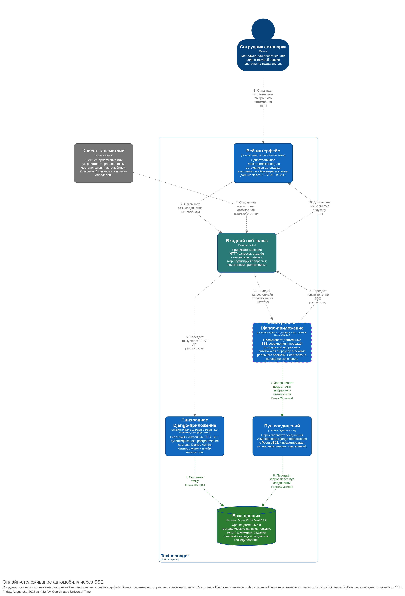

#### Фоновое обратное геокодирование

При запросе поездок Синхронный REST API сначала ищет в PostgreSQL сохранённые адреса начальной и конечной точек. Если адрес не найден, приложение сохраняет задание в очереди на основе базы данных. Фоновый обработчик получает задание и повторно проверяет наличие адреса. Только при его отсутствии обработчик обращается к LocationIQ, после чего сохраняет в PostgreSQL адрес и соответствующую ему географическую область для повторного использования.

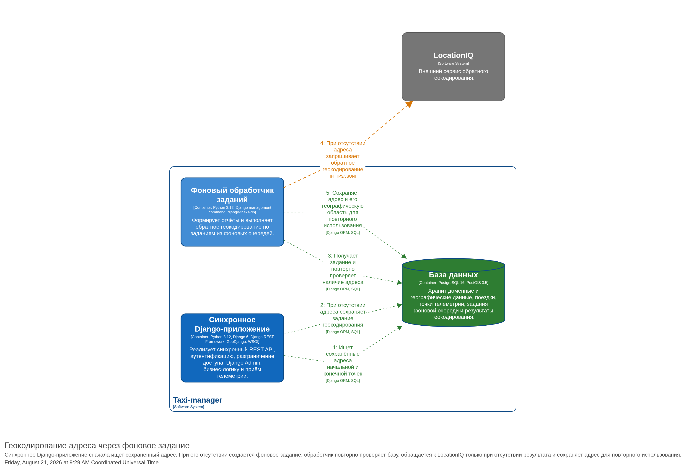

</details>

</details>

<details>
<summary><strong>2. Сервис уведомлений менеджеров</strong></summary>

Это представление дополняет основной функциональный контур подключаемым Сервисом уведомлений менеджеров.

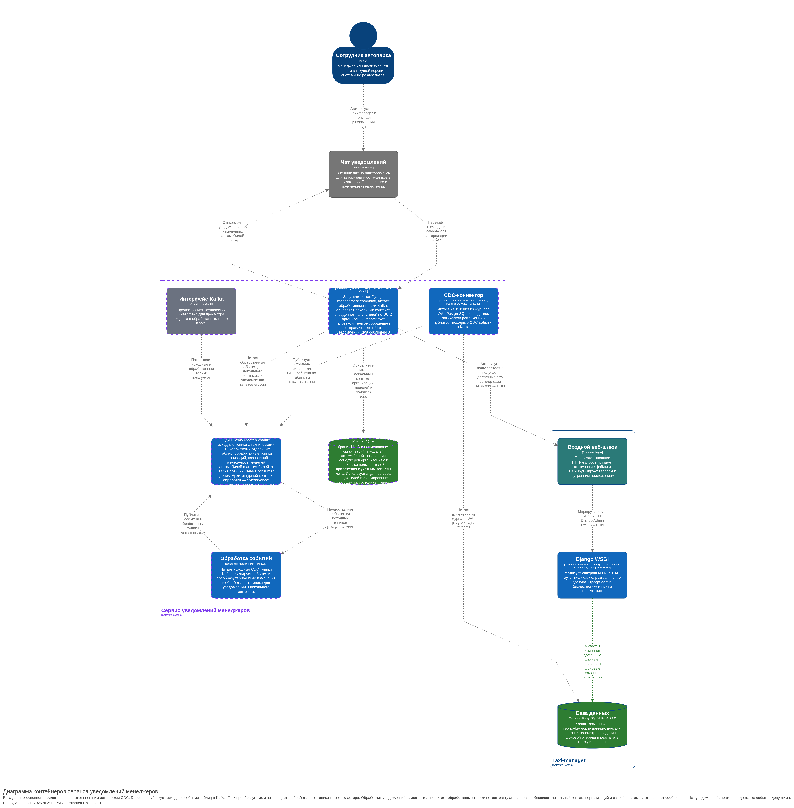

Сервис уведомлений менеджеров получает изменения данных основного приложения посредством CDC. Debezium читает изменения из журнала WAL PostgreSQL и публикует исходные CDC-события в Kafka. База данных находится за границей Сервиса уведомлений менеджеров; Debezium не взаимодействует с Django-приложениями.

Основной поток данных:

`PostgreSQL WAL → Debezium → Kafka (исходные топики) → Flink → Kafka (обработанные топики)`.

Обработчик уведомлений самостоятельно читает обработанные топики Kafka и отправляет подготовленные сообщения в Чат уведомлений.

В одном Kafka-кластере используются две группы топиков. Debezium публикует технические события отдельных таблиц в исходные топики `raw_taxi_manager.public.*`. Flink читает их, удаляет избыточные служебные данные и преобразует значимые изменения в интеграционные события со стабильным контрактом для обработчика уведомлений. Обработанные события публикуются в топики организаций, назначений менеджеров, моделей автомобилей и автомобилей: `taxi_manager.enterprises`, `taxi_manager.assignment_managers`, `taxi_manager.vehicle_models` и `taxi_manager.vehicles`.

Обработчик уведомлений запускается в отдельном контейнере как Django management command. Это минимальное Django-приложение без Django Admin, собственной авторизации и HTTP middleware. События организаций содержат UUID и наименование и обновляют локальный справочник организаций. События назначений обновляют связи менеджеров с организациями, а события операций с автомобилями содержат UUID организации. По этому UUID обработчик находит наименование организации, назначенных менеджеров и связанные учётные записи чата, после чего формирует человекочитаемое сообщение и отправляет его через Чат уведомлений на платформе VK.

В локальной базе SQLite обработчик хранит UUID и наименования организаций и моделей автомобилей, назначения менеджеров организациям и связи пользователей приложения с учётными записями чата. Эти данные используются для выбора получателей и формирования понятного текста сообщения. Состояние чтения сообщений в SQLite не хранится: позиции чтения отслеживает consumer group Kafka. Для авторизации пользователь вводит в чате логин и пароль от Приложения Taxi-manager. Обработчик уведомлений передаёт логин и пароль в REST API Приложения Taxi-manager и получает доступные пользователю организации. По результату успешной авторизации создаётся связь между учётной записью приложения и учётной записью чата. Логин и пароль используются только для выполнения запроса и не сохраняются. Возможное направление развития — вынести авторизацию из Django-монолита в отдельный сервис.

| Контейнер C4 | Назначение | Технологии и применение |
| --- | --- | --- |
| **CDC-коннектор** | Чтение изменений из журнала WAL PostgreSQL и публикация технических CDC-событий | Kafka Connect и Debezium используют логическую репликацию PostgreSQL |
| **Брокер сообщений** | Хранение исходных и обработанных топиков, а также позиций чтения consumer groups | Apache Kafka работает в режиме KRaft и разделяет технические CDC-события и интеграционные события |
| **Обработка событий** | Фильтрация CDC-событий и формирование стабильных контрактов для уведомлений | Apache Flink и Flink SQL читают исходные топики и публикуют результат в обработанные топики |
| **Обработчик уведомлений** | Обновление локального контекста, выбор получателей, формирование и отправка сообщений | Python, Django management command, Kafka client и VK API |
| **Хранилище контекста** | Хранение организаций, моделей автомобилей, назначений менеджеров и связей пользователей с чатами | SQLite обеспечивает локальное транзакционное хранилище обработчика; позиции чтения Kafka в нём не дублируются |
| **Интерфейс Kafka** | Технический просмотр топиков и сообщений | Kafka UI используется для диагностики потока событий |
| **Чат уведомлений** | Авторизация сотрудника в приложении и доставка уведомлений | Внешний чат на платформе VK взаимодействует с обработчиком через VK API |

В текущей реализации строгая гарантия доставки событий не обеспечена. Kafka-клиент автоматически сохраняет и периодически фиксирует позиции чтения, поэтому момент фиксации offset не связан с успешным завершением обработки: при сбое событие может быть обработано повторно либо пропущено.

Для обеспечения гарантии **«один или более раз» (at-least-once)** на участке Kafka → Обработчик уведомлений необходимо установить `enable.auto.offset.store=false` и вызывать `store_offsets(message)` только после успешного обновления локального контекста и отправки уведомления. Альтернативный вариант — установить `enable.auto.commit=false` и явно вызывать `commit()` после успешной обработки.

Сбой после отправки сообщения в Чат уведомлений, но до фиксации offset приведёт к повторной обработке события. Если повторные пользовательские сообщения недопустимы, обработчику дополнительно требуется идемпотентность или дедупликация. Гарантия exactly-once для отправки сообщений во внешний API чата не заявляется.

#### Архитектурное решение: получение и преобразование событий

Debezium выбран для получения изменений непосредственно из PostgreSQL без модификации операций основного приложения. Такой подход не требует, чтобы Django или другие сервисы явно создавали события уведомлений.

Исходные CDC-события содержат служебную структуру Debezium и отражают технические изменения строк. Flink отделяет значимые изменения, преобразует их в стабильный контракт интеграционных событий и исключает операции, для которых уведомления не требуются.

Рассматривались следующие альтернативы:

- **Outbox:** потребовал бы изменить существующий путь записи данных — создавать записи Outbox из прикладного кода либо с помощью триггеров. Flink мог бы не потребоваться, если бы записи сразу формировались в целевом формате.
- **Публикация в Kafka из Django:** увеличила бы связность основного приложения с Сервисом уведомлений менеджеров и потребовала бы решать проблему согласованности между транзакцией PostgreSQL и публикацией сообщения. При переносе операций в сервисы на другом технологическом стеке механизм публикации пришлось бы реализовывать повторно.
- **Постановка заданий в очередь из Django:** сейчас это был бы предпочтительный прикладной вариант. Он использовал бы уже применяемый механизм [Django Tasks](https://docs.djangoproject.com/en/6.0/topics/tasks/) с backend `django-tasks-db` и существенно упростил бы инфраструктуру. При этом основное приложение отвечало бы за определение событий уведомлений, постановку заданий и согласованность с изменениями данных.

В учебных целях была выбрана наиболее развёрнутая схема с Debezium, Kafka и Flink, объединяющая подходы, рассматриваемые на конференциях и учебных курсах по Kafka. Она позволяет на практике изучить CDC, разделение исходных и обработанных топиков и потоковое преобразование событий. Цена такого выбора — дополнительная инфраструктура и зависимость преобразования от структуры данных PostgreSQL.

Диаграммы этого раздела показывают реализованный учебный вариант. Предпочтение Django Tasks является текущей оценкой альтернативы, а не утверждением, что замена уже выполнена.

<details>
<summary>Последовательность формирования уведомления</summary>

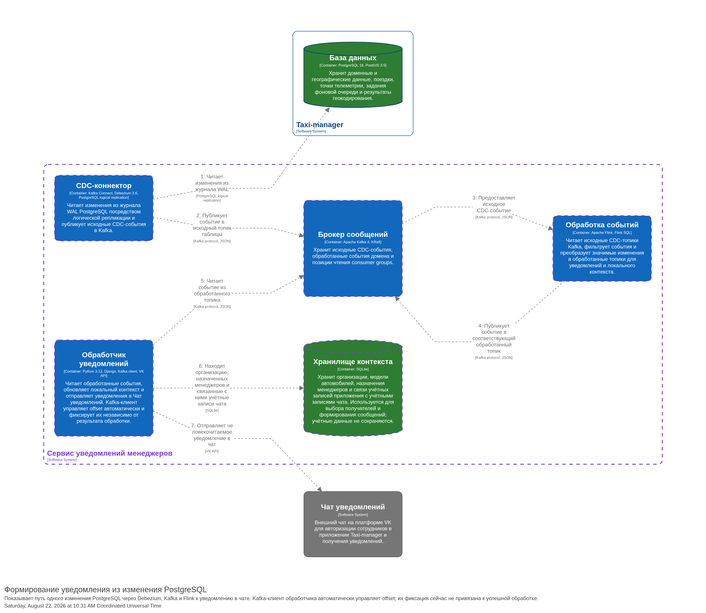

</details>

</details>

<details>
<summary><strong>3. Кэширование</strong></summary>

В приложении используются и рассматриваются три разных уровня кэширования: прикладной кэш Django, HTTP-кэш и внутренний буферный кэш PostgreSQL. Они решают разные задачи и не заменяют друг друга.

**Прикладной кэш.** Django работает с кэшируемыми данными через Django Cache API. В локальном окружении в качестве общего backend используется Memcached. Прикладной кэш следует применять к данным, повторное получение или формирование которых по результатам измерений является узким местом.

**HTTP-кэш.** Varnish предназначен для возврата повторяющихся HTTP-ответов чтения без повторной обработки запроса в REST API. В базовом целевом варианте Входной веб-шлюз остаётся единой внешней HTTP-точкой входа, а один HTTP-кэш располагается после него. Общедоступные кэшируемые запросы передаются в HTTP-кэш непосредственно. Защищённые запросы могут передаваться в него только после проверки доступа Сервисом авторизации; если содержимое ответа зависит от организации, области доступа или пользователя, доверенный контекст доступа должен учитываться в ключе кэша. Операции записи и остальные некэшируемые запросы обходят HTTP-кэш.

Количество и размещение HTTP-кэшей зависят от измеренного профиля нагрузки: соотношения общедоступных и защищённых запросов, доли операций чтения, стоимости формирования ответов и достигаемого процента попаданий в кэш. Если в профиле нагрузки преобладают повторяющиеся общедоступные запросы чтения и прохождение через Nginx становится измеренным узким местом, перед Nginx может быть добавлен отдельный граничный HTTP-кэш для общедоступных данных. Защищённые ответы при этом продолжают кэшироваться только после проверки доступа.

Существующая локальная конфигурация Varnish является экспериментальной: она размещает Varnish перед Nginx и пока не реализует целевое безопасное кэширование защищённых ответов с учётом контекста доступа.

**Кэш PostgreSQL.** PostgreSQL использует собственный буферный кэш и кэш операционной системы, уменьшающие количество физических чтений с диска. Это внутренние механизмы СУБД, а не backend Django Cache API, поэтому они не заменяют Memcached или HTTP-кэш.

</details>

<details>
<summary><strong>4. Наблюдаемость</strong></summary>

Коллектор наблюдаемости Grafana Alloy является внутренним контейнером приложения и единой точкой сбора и маршрутизации данных о его работе. Приложения отправляют ему трассировки по OTLP, Alloy собирает метрики через Prometheus scrape и читает журналы контейнеров, после чего передаёт полученные данные во внешний Сервис хранения и визуализации данных мониторинга.

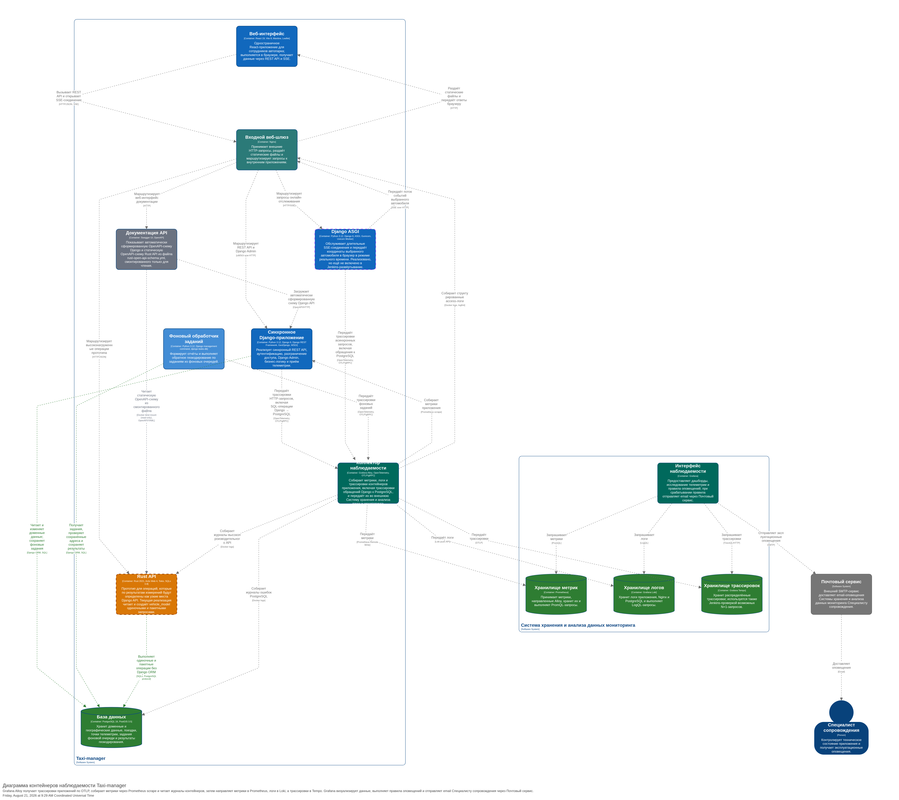

Сервис хранения и визуализации данных мониторинга хранит данные о работе приложения: метрики — в Prometheus, логи — в Loki, распределённые трассировки — в Tempo. Grafana запрашивает данные из этих хранилищ, отображает их на дашбордах и выполняет правила оповещений. Компоненты приложения не передают данные мониторинга в хранилища напрямую: основной поток проходит через Grafana Alloy.

При срабатывании правила Grafana отправляет email-оповещение через внешний Почтовый сервис Специалисту сопровождения. Это эксплуатационные оповещения о состоянии приложения; они отделены от предметных уведомлений менеджерам об изменениях автомобилей.

Дополнительные метрики Grafana Alloy получает от следующих компонентов: встроенного в Alloy `prometheus.exporter.process`, cAdvisor, Nginx Prometheus Exporter и Varnish Exporter. GoAccess используется отдельно для анализа журналов доступа и не входит в основной поток телеметрии.

Наблюдаемость может быть расширена профилированием производительности с помощью Grafana Pyroscope. Оно позволяет находить функции Django-приложений и Фонового обработчика заданий, потребляющие больше всего процессорного времени. Проведённые замеры не выявили заметного увеличения времени ответа при включённом профилировании. Профили передаются в Pyroscope через Grafana Alloy. Pyroscope намеренно не показан на основной C4-диаграмме наблюдаемости.

Основные технологии: OpenTelemetry, OTLP/gRPC, Grafana Alloy, Prometheus, Loki, Tempo и Grafana.

</details>

<details>
<summary><strong>5. CI/CD</strong></summary>

Схема показывает Jenkins-мастер, Jenkins-агент и Compose-проект `taxi-manager-deploy` на целевом Docker-хосте. GitHub Actions разворачивает и обновляет контейнер Jenkins-агента на удалённом сервере через SSH и Docker Compose. Это упрощённое представление физического размещения: последовательность выполнения конвейера и используемые файлы показаны в отдельных CI/CD-представлениях.

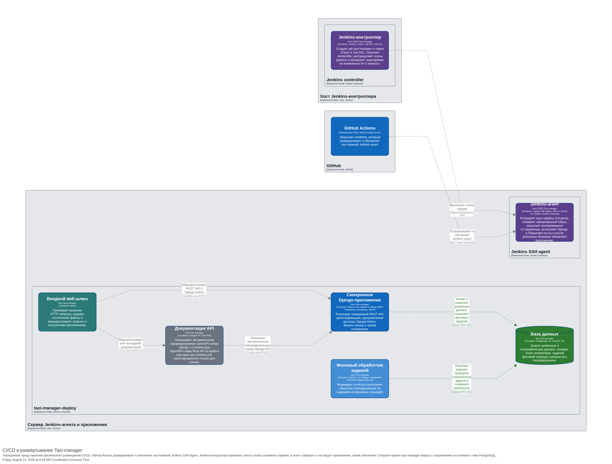

Jenkins-мастер получает из репозитория `Jenkinsfile` и координирует выполнение основного конвейера CI/CD. Jenkins-агент клонирует исходный код вместе с `Dockerfile`, `compose.jenkins-ci.yaml` и `compose.deploy.yaml`, получает базовые и тестовые образы, собирает нумерованный образ приложения, запускает проверки и тесты, а после их успешного завершения развёртывает приложение. Jenkins-мастер использует трассировки из Tempo для поиска возможных N+1-запросов.

После успешного завершения проверок этап CD применяет `compose.deploy.yaml` и пересоздаёт рабочие контейнеры приложения с образом текущей успешно проверенной сборки. Существующая база данных и том `deploy-db` сохраняются; перед запуском новой версии выполняются миграции. На главной странице приложения находится ссылка **«сборка»** на `/deploy-info/`, где показаны хэш и дата-время коммита, а также дата-время развёртывания.

Подробное распределение конфигурации между репозиториями приведено в разделе [CI/CD](#cicd).

Конфигурация Jenkins-мастера и Jenkins-агента хранится в отдельном репозитории [`jenkins-config`](https://github.com/metacortex687/jenkins-config).

Используемые технологии: GitHub Actions, Jenkins Pipeline, Jenkins Configuration as Code, Job DSL, Jenkins SSH Agent, JDK 21, Git, SSH, Docker CLI, Docker Buildx и Docker Compose.

<details>
<summary>Последовательность основного Jenkins pipeline</summary>

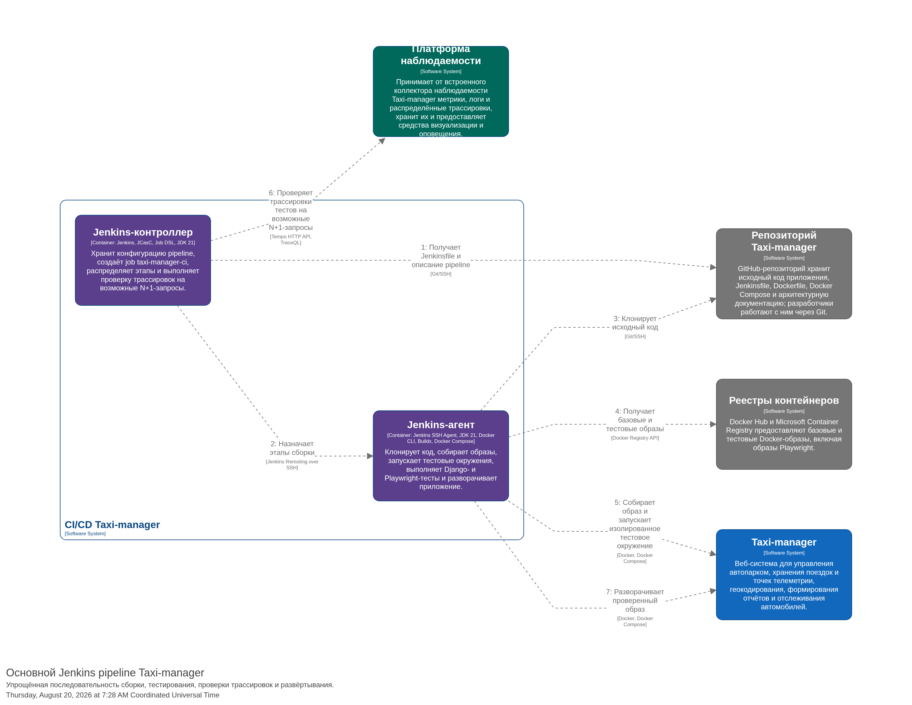

</details>

</details>

### Источники и границы достоверности

<details>
<summary><strong>Исходные файлы для проверки архитектурного описания</strong></summary>

Полный состав, точные версии зависимостей и фактическую конфигурацию следует проверять по исходным файлам:

| Исходные файлы | К каким элементам относятся |
| --- | --- |
| [`pyproject.toml`](pyproject.toml), [`uv.lock`](uv.lock) | Синхронный REST API, Асинхронный REST API и SSE, Фоновый обработчик заданий |
| [`package.json`](taxi_manager/infrastructure/react_frontend/package.json), [`package-lock.json`](taxi_manager/infrastructure/react_frontend/package-lock.json) | Веб-интерфейс React |
| [`rust-api/Cargo.toml`](rust-api/Cargo.toml) | Высокопроизводительный асинхронный REST API |
| [`notification_service/pyproject.toml`](notification_service/pyproject.toml), [`notification_service/uv.lock`](notification_service/uv.lock) | Сервис уведомлений менеджеров, Обработчик уведомлений и Хранилище контекста |
| [`Dockerfile`](Dockerfile) | Общий образ серверных контейнеров Django: Синхронного REST API, Асинхронного REST API и SSE, а также Фонового обработчика заданий |
| [`nginx.conf`](nginx.conf), [`nginx.deploy.conf.template`](nginx.deploy.conf.template) | Входной веб-шлюз и страница `/deploy-info/` |
| [`config.alloy`](config.alloy), [`docker-compose.dev-local.observability.yaml`](docker-compose.dev-local.observability.yaml), [`docker-compose.dev.observability.yaml`](docker-compose.dev.observability.yaml) | Коллектор наблюдаемости и его подключения к Сервису хранения и визуализации данных мониторинга |
| [`Jenkinsfile`](Jenkinsfile), [`compose.jenkins-ci.yaml`](compose.jenkins-ci.yaml), [`compose.deploy.yaml`](compose.deploy.yaml) | Jenkins pipeline, изолированное CI-окружение и фактическое развёртывание приложения |
| [`Makefile`](Makefile) | Команды сборки, проверок, запуска процессов и экспорта архитектурных схем |
| [`docs/architecture/workspace.dsl`](docs/architecture/workspace.dsl) | Корневой файл Structurizr DSL: подключает модели, представления и общие стили через директивы `!include` |

</details>

## Нагрузочное тестирование

<details>
<summary><strong>Условия, результаты и выводы экспериментов</strong></summary>

Для выбора технических решений в read-heavy- и write-heavy-сценариях проведена серия нагрузочных экспериментов на эндпоинтах создания бренда и получения бренда по идентификатору. Нагрузка формировалась с помощью k6, а метрики и трассировки анализировались в Grafana, Prometheus и Tempo.

Тесты выполнялись на облачной машине со следующими характеристиками:

- 2 vCPU с частотой 2,6–3,0 ГГц;
- гарантированная доля процессора — 10%;
- 4 ГБ RAM;
- SSD.

Полученные значения относятся к конкретному тестовому окружению и использованным сценариям. Их следует рассматривать как результаты сравнительного эксперимента, а не как гарантированную производительность приложения в другой инфраструктуре.

| Вариант | Операция | Устойчивый результат | Пиковый результат |
| --- | --- | ---: | ---: |
| Django WSGI | Чтение | около 150 RPS | — |
| Django ASGI | Чтение | около 150 RPS | без заметного улучшения |
| Actix Web | Запись | около 1900 RPS | около 3000 RPS |
| Actix Web с пакетной записью | Запись | около 1500 RPS | 4000–5000 RPS |
| Actix Web | Чтение | около 4000 RPS | около 6500 RPS |
| Varnish при 100% попаданий в кэш | Чтение | — | около 9500 RPS |

<details>
<summary><strong>Интерпретация результатов экспериментов</strong></summary>

### Django WSGI и ASGI

Перенос исследованного эндпоинта чтения с WSGI на ASGI не увеличил пропускную способность: количество одновременно обрабатываемых запросов выросло, но одновременно увеличилось время ответа. Устойчивый результат остался около 150 RPS.

В проанализированных трассировках выполнение SQL занимало менее 5% общего времени запроса. Основная часть времени приходилась на middleware, ORM и прикладную обработку. В этом сценарии ограничение находилось не в PostgreSQL, поэтому увеличение числа соединений через PgBouncer само по себе не повышало пропускную способность. PgBouncer при этом остаётся необходимым для предотвращения исчерпания соединений при работе ASGI-процессов.

Предыдущие измерения показывали заметный прирост чтения после кэширования, отключения лишней пагинации и переноса сериализации геоданных в PostgreSQL. Для записи эти способы применимы ограниченно. Отложенная запись через очередь с ответом `202 Accepted` возможна, но меняет контракт операции и модель согласованности, поэтому не является прямой заменой синхронной записи.

### Actix Web

Простой эндпоинт записи на Actix Web показал около 1900 RPS устойчивой нагрузки и около 3000 RPS в пике. Пакетная запись группами до 100 запросов или с ожиданием до 50 мс увеличила пиковое значение до 4000–5000 RPS, но устойчивый результат составил около 1500 RPS. Поэтому предпочтительным остаётся более простое решение без внутренней очереди пакетной записи.

Эндпоинт чтения на Actix Web показал около 4000 RPS устойчивой нагрузки и около 6500 RPS в пике. Эксперимент с накоплением запросов чтения и выполнением одного пакетного SQL-запроса дал результат хуже простой параллельной обработки. Предположительная причина — один воркер и одно соединение с базой данных вместо нескольких параллельных соединений.

### HTTP-кэш Varnish

При 100% попаданий в HTTP-кэш Varnish было получено около 9500 RPS. Это синтетическая верхняя граница для повторяющихся ответов, не зависящих от пользователя. Практический результат будет определяться процентом попаданий, стоимостью промаха и соотношением общедоступных и защищённых запросов.

### Выводы

Для write-heavy-сценария перенос измеренного узкого места в простой REST API на Actix Web позволил увеличить результат первоначальной реализации примерно со 100 до 3000 RPS в пике. Усложнение внутренними очередями оправдано только после отдельных измерений устойчивой нагрузки и влияния на семантику записи.

Для read-heavy-сценария при высокой повторяемости запросов целесообразен HTTP-кэш. Если доля уникальных запросов велика или процент попаданий недостаточен, измеренное узкое место можно переносить в Высокопроизводительный асинхронный REST API. Решение о числе и размещении кэшей принимается по фактическому профилю нагрузки.

</details>

Описание сценариев находится в [`performance/README.md`](performance/README.md). Конфигурация нагрузочного окружения хранится в [`docker-compose.dev-local.load-testing.yaml`](docker-compose.dev-local.load-testing.yaml) и [`docker-compose.dev.observability.load-testing.yaml`](docker-compose.dev.observability.load-testing.yaml). Используемый dashboard находится в [`grafana/dashboards/load-testing-current-source-metrics.json`](grafana/dashboards/load-testing-current-source-metrics.json).

</details>

## Быстрый запуск демо-версии

<details>
<summary><strong>Требования, настройка, запуск и остановка</strong></summary>

### Требования

Для запуска необходимы:

- Git;

- Docker Engine или Docker Desktop;

- Docker Compose версии 2.


Проверить доступность Docker можно командами:

```bash
docker version
docker compose version
```

### Клонирование репозитория

```bash
git clone https://github.com/metacortex687/taxi-manager.git
cd taxi-manager
```

### Настройка переменных окружения

Создайте файл `.env` на основе примера:

```bash
cp .env.example .env
```

При необходимости измените параметры подключения к PostgreSQL, секретный ключ Django, данные администратора и API-ключ LocationIQ:

```env
LOCATIONIQ_KEY=your-locationiq-key

POSTGRES_USER=taxi_manager
POSTGRES_PASSWORD=secret
POSTGRES_DB=taxi_manager

DJANGO_SECRET_KEY=change-me

DJANGO_SUPERUSER_NAME=admin
DJANGO_SUPERUSER_PASSWORD=admin
DJANGO_SUPERUSER_EMAIL=admin@example.com
```

Указанные значения предназначены только для локального демонстрационного запуска. При развёртывании приложения на доступном извне сервере необходимо использовать собственные стойкие пароли и секретный ключ.

Файл `.env` используется Docker Compose для подстановки переменных и исключён из контекста сборки Docker-образа правилами `.dockerignore`.

### Запуск приложения

```bash
docker compose -f docker-compose.demo.yaml up -d --build
```

При первом запуске Docker соберёт образ приложения, создаст базу данных, применит миграции и загрузит демонстрационные данные.

Демонстрационная конфигурация запускает Входной веб-шлюз, Синхронный REST API и PostgreSQL/PostGIS. Фоновый обработчик заданий, Асинхронный REST API и SSE, Высокопроизводительный асинхронный REST API, Сервис уведомлений менеджеров и наблюдаемость в этот вариант не входят.

Состояние контейнеров можно проверить командой:

```bash
docker compose -f docker-compose.demo.yaml ps
```

Для просмотра процесса запуска приложения:

```bash
docker compose -f docker-compose.demo.yaml logs -f taxi-manager
```

После запуска пользовательский интерфейс будет доступен по адресу:

```text
http://localhost/
```

### Остановка приложения

```bash
docker compose -f docker-compose.demo.yaml down
```

Повторный запуск выполняется без пересоздания базы данных:

```bash
docker compose -f docker-compose.demo.yaml up -d
```

</details>

## Демонстрационные данные

<details>
<summary><strong>Состав данных, учётные записи и пересоздание базы</strong></summary>

При запуске контейнера приложения последовательно выполняются:

```text
make migrate
make ensure-superuser
make ensure-demo-data
make run-uwsgi
```

Команда `ensure-demo-data` обеспечивает наличие демонстрационных организаций, автомобилей, водителей, поездок и других данных, необходимых для ознакомления с возможностями приложения.

Для входа в пользовательский интерфейс можно использовать следующие учётные записи:

|Пользователь|Пароль|
|---|---|
|`manager1`|`manager1`|
|`manager2`|`manager2`|

Учётная запись администратора Django создаётся из параметров `DJANGO_SUPERUSER_NAME`, `DJANGO_SUPERUSER_PASSWORD` и `DJANGO_SUPERUSER_EMAIL`, указанных в файле `.env`.

Повторно выполнить проверку и загрузку демонстрационных данных можно командой:

```bash
docker compose -f docker-compose.demo.yaml exec taxi-manager make ensure-demo-data
```

### Полное пересоздание демонстрационной базы

Чтобы удалить существующую базу данных и создать её заново:

```bash
docker compose -f docker-compose.demo.yaml down -v
docker compose -f docker-compose.demo.yaml up -d --build
```

> Команда `down -v` удаляет Docker-том с базой данных. Все изменения, внесённые после запуска демонстрационной версии, будут потеряны.

</details>

## Быстрый запуск минимально работающего приложения

<details>
<summary><strong>Настройка, запуск и остановка</strong></summary>

Минимальная конфигурация использует те же требования и файл `.env`, что и демонстрационная версия. Она запускает Входной веб-шлюз, Синхронный REST API и Базу данных PostgreSQL/PostGIS, но не загружает демонстрационные данные.

Фоновый обработчик заданий, Асинхронный REST API и SSE, Высокопроизводительный асинхронный REST API, Сервис уведомлений менеджеров и наблюдаемость в минимальный вариант также не входят.

Перед запуском демонстрационную версию следует остановить, поскольку обе конфигурации публикуют приложение на порту 80:

```bash
docker compose -f docker-compose.demo.yaml down
```

Запустите минимальную конфигурацию:

```bash
docker compose -f docker-compose.minimal.yaml up -d --build
```

При первом запуске последовательно выполняются:

```text
make migrate
make ensure-superuser
make run-uwsgi
```

В отличие от демонстрационного запуска, минимальная конфигурация не создаёт демонстрационные организации, автомобили, водителей, поездки и учётные записи сотрудников. Учётная запись администратора создаётся из переменных `DJANGO_SUPERUSER_NAME`, `DJANGO_SUPERUSER_PASSWORD` и `DJANGO_SUPERUSER_EMAIL`.

Пользовательский интерфейс будет доступен по адресу `http://localhost/`, Django Admin — по адресу `http://localhost/admin/`. Перед использованием прикладных функций может потребоваться первоначальная настройка через Django Admin: создание организаций и сотрудников, а также назначение сотрудникам доступных организаций.

Состояние контейнеров и процесс запуска можно проверить командами:

```bash
docker compose -f docker-compose.minimal.yaml ps
docker compose -f docker-compose.minimal.yaml logs -f taxi-manager
```

Для остановки приложения:

```bash
docker compose -f docker-compose.minimal.yaml down
```

Минимальная и демонстрационная конфигурации используют разные Compose-проекты и разные тома PostgreSQL, поэтому демонстрационные данные не попадут в минимальную базу.

</details>

## CI/CD

Основной CI/CD-конвейер проекта реализован с помощью Jenkins и распределён между двумя репозиториями.

<details>
<summary><strong>Репозитории и схема работы Jenkins</strong></summary>

В этом репозитории находятся:

- исходный код приложения;

- файл [`Jenkinsfile`](Jenkinsfile) с описанием конвейера;

- конфигурация тестового окружения [`compose.jenkins-ci.yaml`](compose.jenkins-ci.yaml);

- конфигурация развёртывания [`compose.deploy.yaml`](compose.deploy.yaml).


Инфраструктура Jenkins находится в отдельном репозитории [metacortex687/jenkins-config](https://github.com/metacortex687/jenkins-config).

Этот репозиторий содержит:

- конфигурацию Jenkins-мастера;

- Jenkins Configuration as Code;

- описание заданий с помощью Job DSL;

- конфигурацию Jenkins-агента;

- GitHub Actions workflow для развёртывания и обновления Jenkins-агента.


При запуске Jenkins-мастера автоматически создаётся задание `taxi-manager-ci`, которое получает `Jenkinsfile` из этого репозитория. Jenkins-мастер подключается к Jenkins-агенту по SSH и назначает ему этапы конвейера. Jenkins-агент выполняет сборку образа приложения, запускает проверки и тесты, а после их успешного завершения обновляет контейнеры приложения. При развёртывании используется образ проверенной сборки, а существующий том базы данных сохраняется.

Jenkins-мастер координирует конвейер CI/CD Приложения Taxi-manager, а Jenkins-агент выполняет его этапы. GitHub Actions из репозитория `jenkins-config` развёртывает и обновляет Jenkins-агент. Сохранённый в этом репозитории workflow [`.github/workflows/main-dev.yml`](.github/workflows/main-dev.yml) использовался для прежнего сценария тестирования, сборки образов и развёртывания приложения; сейчас он запускается только вручную и не входит в Jenkins-конвейер CI/CD.

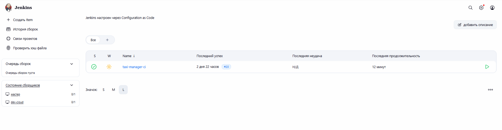

</details>


## Конфигурационные файлы

В этом разделе перечислены точки входа автоматизации, Docker Compose-файлы и связанные с ними конфигурации из репозиториев Taxi-manager и [`jenkins-config`](https://github.com/metacortex687/jenkins-config). Таблицы содержат назначение и прямые зависимости файлов, а расположенные под ними графы Mermaid показывают те же связи.

### Граф зависимостей конфигурационных файлов

В таблицах для каждого **исходного файла** перечислены файлы, от которых он непосредственно зависит. На расположенной под таблицей Mermaid-диаграмме этому соответствует стрелка `A --> B`: файл `A` зависит от файла `B`.

Показаны прямые зависимости, которые заданы через подключение файла, Docker build context, bind mount, `!include` либо обязательное дополнение Compose. Связи от автоматизации к создаваемым ею файлам окружения не показаны; при этом файл окружения указан как зависимость Compose-файла, если тот явно его читает. Каталоги с результатами и взаимодействия сервисов во время выполнения в граф не включены.

<details>
<summary><strong>Автоматизация и удалённые развёртывания</strong></summary>

#### Табличное представление

| Исходный файл | Смысл зависимости | Зависит от файлов |
| --- | --- | --- |
| `.github/workflows/main-dev.yml` | Собирает образы, копирует конфигурацию на сервер и запускает основной стек. | `Makefile`<br>`Dockerfile`<br>`rust-api/Dockerfile`<br>`varnish-exporter/Dockerfile`<br>`notification_service/Dockerfile`<br>`docker-compose.dev.yaml`<br>`docker-compose.kafka.yaml`<br>`docker-compose.notification-service.yaml`<br>`nginx.conf`<br>`config.alloy`<br>`varnish/default.vcl` |
| `.github/workflows/observability-cloud.yml` | Копирует и запускает удалённый стек наблюдаемости и нагрузочного тестирования. | `docker-compose.dev.observability.yaml`<br>`docker-compose.dev.observability.load-testing.yaml`<br>`tempo.yaml`<br>`prometheus.yml`<br>`loki-config.yaml`<br>`config.alloy`<br>`grafana/provisioning/datasources/loki.yaml`<br>`grafana/provisioning/datasources/prometheus.yaml`<br>`grafana/provisioning/datasources/pyroscope.yaml`<br>`grafana/provisioning/datasources/tempo.yaml`<br>`Makefile`<br>`.load-testing.env.default` |
| `Jenkinsfile` | Запускает CI-стек и применяет конфигурацию развёртывания. | `compose.jenkins-ci.yaml`<br>`compose.deploy.yaml` |
| `compose.jenkins-ci.yaml` | Собирает основной образ приложения из корневого Dockerfile. | `Dockerfile` |
| `compose.deploy.yaml` | Дополняет CI-стек настройками развёртывания и монтируемыми файлами API и Nginx. | `compose.jenkins-ci.yaml`<br>`nginx.deploy.conf.template`<br>`rust-api/rust-open-api-schema.yml` |
| `jenkins-config/.github/workflows/deploy-agent.yml` | Развёртывает Jenkins-агент через Compose-файл каталога jenkins-agent. | `jenkins-config/jenkins-agent/compose.yaml` |
| `jenkins-config/jenkins-agent/compose.yaml` | Собирает образ Jenkins-агента и подключает его конфигурацию Alloy. | `jenkins-config/jenkins-agent/Dockerfile`<br>`jenkins-config/jenkins-agent/config.alloy` |
| `jenkins-config/compose.yaml` | Собирает Jenkins-мастер и подключает JCasC и конфигурацию наблюдаемости. | `jenkins-config/Dockerfile`<br>`jenkins-config/casc/jenkins.yaml`<br>`jenkins-config/observability/tempo/tempo.yml`<br>`jenkins-config/observability/grafana/provisioning/datasources/datasources.yml` |
| `jenkins-config/Dockerfile` | Устанавливает плагины Jenkins из фиксированного списка. | `jenkins-config/plugins.txt` |
| `jenkins-config/casc/jenkins.yaml` | Настраивает multibranch pipeline Taxi-manager и указывает его Script Path. | `Jenkinsfile` |

#### Mermaid

```mermaid
flowchart TB
    mainDev[".github/workflows/main-dev.yml"]
    makefile["Makefile"]
    appDockerfile["Dockerfile"]
    rustDockerfile["rust-api/Dockerfile"]
    varnishExporterDockerfile["varnish-exporter/Dockerfile"]
    notificationDockerfile["notification_service/Dockerfile"]
    devCompose["docker-compose.dev.yaml"]
    kafkaCompose["docker-compose.kafka.yaml"]
    notificationCompose["docker-compose.notification-service.yaml"]
    nginxConfig["nginx.conf"]
    alloyConfig["config.alloy"]
    varnishConfig["varnish/default.vcl"]
    obsWorkflow[".github/workflows/observability-cloud.yml"]
    remoteObs["docker-compose.dev.observability.yaml"]
    remoteLoad["docker-compose.dev.observability.load-testing.yaml"]
    tempoConfig["tempo.yaml"]
    prometheusConfig["prometheus.yml"]
    lokiConfig["loki-config.yaml"]
    dsLoki["grafana/provisioning/datasources/loki.yaml"]
    dsPrometheus["grafana/provisioning/datasources/prometheus.yaml"]
    dsPyroscope["grafana/provisioning/datasources/pyroscope.yaml"]
    dsTempo["grafana/provisioning/datasources/tempo.yaml"]
    loadEnvDefault[".load-testing.env.default"]
    jenkinsfile["Jenkinsfile"]
    jenkinsCi["compose.jenkins-ci.yaml"]
    deployCompose["compose.deploy.yaml"]
    nginxDeploy["nginx.deploy.conf.template"]
    rustSchema["rust-api/rust-open-api-schema.yml"]
    deployAgentWorkflow["jenkins-config/.github/workflows/deploy-agent.yml"]
    agentCompose["jenkins-config/jenkins-agent/compose.yaml"]
    agentDockerfile["jenkins-config/jenkins-agent/Dockerfile"]
    agentAlloy["jenkins-config/jenkins-agent/config.alloy"]
    jenkinsMasterCompose["jenkins-config/compose.yaml"]
    jenkinsMasterDockerfile["jenkins-config/Dockerfile"]
    casc["jenkins-config/casc/jenkins.yaml"]
    jenkinsTempo["jenkins-config/observability/tempo/tempo.yml"]
    jenkinsGrafanaDatasources["jenkins-config/observability/grafana/provisioning/datasources/datasources.yml"]
    plugins["jenkins-config/plugins.txt"]

    mainDev --> makefile
    mainDev --> appDockerfile
    mainDev --> rustDockerfile
    mainDev --> varnishExporterDockerfile
    mainDev --> notificationDockerfile
    mainDev --> devCompose
    mainDev --> kafkaCompose
    mainDev --> notificationCompose
    mainDev --> nginxConfig
    mainDev --> alloyConfig
    mainDev --> varnishConfig
    obsWorkflow --> remoteObs
    obsWorkflow --> remoteLoad
    obsWorkflow --> tempoConfig
    obsWorkflow --> prometheusConfig
    obsWorkflow --> lokiConfig
    obsWorkflow --> alloyConfig
    obsWorkflow --> dsLoki
    obsWorkflow --> dsPrometheus
    obsWorkflow --> dsPyroscope
    obsWorkflow --> dsTempo
    obsWorkflow --> makefile
    obsWorkflow --> loadEnvDefault
    jenkinsfile --> jenkinsCi
    jenkinsfile --> deployCompose
    jenkinsCi --> appDockerfile
    deployCompose --> jenkinsCi
    deployCompose --> nginxDeploy
    deployCompose --> rustSchema
    deployAgentWorkflow --> agentCompose
    agentCompose --> agentDockerfile
    agentCompose --> agentAlloy
    jenkinsMasterCompose --> jenkinsMasterDockerfile
    jenkinsMasterCompose --> casc
    jenkinsMasterCompose --> jenkinsTempo
    jenkinsMasterCompose --> jenkinsGrafanaDatasources
    jenkinsMasterDockerfile --> plugins
    casc --> jenkinsfile
```

</details>

<details>
<summary><strong>Локальный запуск, Kafka и сервис уведомлений</strong></summary>

#### Табличное представление

| Исходный файл | Смысл зависимости | Зависит от файлов |
| --- | --- | --- |
| `docker-compose.demo.yaml` | Собирает приложение и подключает конфигурацию Nginx для демо-запуска. | `Dockerfile`<br>`nginx.conf` |
| `docker-compose.minimal.yaml` | Собирает минимальный стек приложения и подключает конфигурацию Nginx. | `Dockerfile`<br>`nginx.conf` |
| `docker-compose.dev-local.yaml` | Собирает локальные образы и монтирует конфигурации приложения, API, Alloy, Varnish и Nginx. | `Dockerfile`<br>`rust-api/Dockerfile`<br>`varnish-exporter/Dockerfile`<br>`config.alloy`<br>`nginx.conf`<br>`varnish/default.vcl`<br>`rust-api/rust-open-api-schema.yml` |
| `docker-compose.dev-local.observability.yaml` | Монтирует конфигурации локальной платформы наблюдаемости и Grafana. | `loki-config.yaml`<br>`tempo.yaml`<br>`prometheus.yml`<br>`grafana/provisioning/datasources/loki.yaml`<br>`grafana/provisioning/datasources/prometheus.yaml`<br>`grafana/provisioning/datasources/pyroscope.yaml`<br>`grafana/provisioning/datasources/tempo.yaml`<br>`grafana/dashboards/load-testing-current-source-metrics.json` |
| `docker-compose.dev-local.load-testing.yaml` | Использует Prometheus из локального стека наблюдаемости, параметры теста и сценарий k6. | `docker-compose.dev-local.observability.yaml`<br>`.load-testing.env`<br>`performance/load_test_rps_ladder_simple.js` |
| `docker-compose.kafka.yaml` | Подключает конфигурацию Debezium и собирает Flink job со схемами потоков. | `kafka/debezium-postgres.json`<br>`kafka/flink/Dockerfile`<br>`kafka/flink/sql/001-assignment-manager.sql`<br>`kafka/flink/sql/002-enterprises.sql`<br>`kafka/flink/sql/003-vehicles.sql`<br>`kafka/flink/sql/004-vehicle-models.sql` |
| `docker-compose.notification-service.yaml` | Загружает переменные окружения сервиса уведомлений. | `.env.notification-service` |

#### Mermaid

```mermaid
flowchart TB
    demoCompose["docker-compose.demo.yaml"]
    appDockerfile["Dockerfile"]
    nginxConfig["nginx.conf"]
    minimalCompose["docker-compose.minimal.yaml"]
    devLocalCompose["docker-compose.dev-local.yaml"]
    rustDockerfile["rust-api/Dockerfile"]
    varnishExporterDockerfile["varnish-exporter/Dockerfile"]
    alloyConfig["config.alloy"]
    varnishConfig["varnish/default.vcl"]
    rustSchema["rust-api/rust-open-api-schema.yml"]
    localObs["docker-compose.dev-local.observability.yaml"]
    lokiConfig["loki-config.yaml"]
    tempoConfig["tempo.yaml"]
    prometheusConfig["prometheus.yml"]
    dsLoki["grafana/provisioning/datasources/loki.yaml"]
    dsPrometheus["grafana/provisioning/datasources/prometheus.yaml"]
    dsPyroscope["grafana/provisioning/datasources/pyroscope.yaml"]
    dsTempo["grafana/provisioning/datasources/tempo.yaml"]
    loadDashboard["grafana/dashboards/load-testing-current-source-metrics.json"]
    localLoad["docker-compose.dev-local.load-testing.yaml"]
    loadEnv[".load-testing.env"]
    loadScript["performance/load_test_rps_ladder_simple.js"]
    kafkaCompose["docker-compose.kafka.yaml"]
    debeziumConfig["kafka/debezium-postgres.json"]
    flinkDockerfile["kafka/flink/Dockerfile"]
    sqlAssignmentManager["kafka/flink/sql/001-assignment-manager.sql"]
    sqlEnterprises["kafka/flink/sql/002-enterprises.sql"]
    sqlVehicles["kafka/flink/sql/003-vehicles.sql"]
    sqlVehicleModels["kafka/flink/sql/004-vehicle-models.sql"]
    notificationCompose["docker-compose.notification-service.yaml"]
    notificationEnv[".env.notification-service"]

    demoCompose --> appDockerfile
    demoCompose --> nginxConfig
    minimalCompose --> appDockerfile
    minimalCompose --> nginxConfig
    devLocalCompose --> appDockerfile
    devLocalCompose --> rustDockerfile
    devLocalCompose --> varnishExporterDockerfile
    devLocalCompose --> alloyConfig
    devLocalCompose --> nginxConfig
    devLocalCompose --> varnishConfig
    devLocalCompose --> rustSchema
    localObs --> lokiConfig
    localObs --> tempoConfig
    localObs --> prometheusConfig
    localObs --> dsLoki
    localObs --> dsPrometheus
    localObs --> dsPyroscope
    localObs --> dsTempo
    localObs --> loadDashboard
    localLoad --> localObs
    localLoad --> loadEnv
    localLoad --> loadScript
    kafkaCompose --> debeziumConfig
    kafkaCompose --> flinkDockerfile
    kafkaCompose --> sqlAssignmentManager
    kafkaCompose --> sqlEnterprises
    kafkaCompose --> sqlVehicles
    kafkaCompose --> sqlVehicleModels
    notificationCompose --> notificationEnv
```

</details>

<details>
<summary><strong>Наблюдаемость и C4-модель</strong></summary>

#### Табличное представление

| Исходный файл | Смысл зависимости | Зависит от файлов |
| --- | --- | --- |
| `docker-compose.dev.observability.yaml` | Монтирует конфигурации удалённой платформы наблюдаемости и Grafana. | `loki-config.yaml`<br>`tempo.yaml`<br>`prometheus.yml`<br>`grafana/provisioning/datasources/loki.yaml`<br>`grafana/provisioning/datasources/prometheus.yaml`<br>`grafana/provisioning/datasources/pyroscope.yaml`<br>`grafana/provisioning/datasources/tempo.yaml`<br>`grafana/dashboards/load-testing-current-source-metrics.json` |
| `docker-compose.dev.observability.load-testing.yaml` | Использует Prometheus из удалённого стека наблюдаемости, параметры теста и сценарий k6. | `docker-compose.dev.observability.yaml`<br>`.load-testing.env`<br>`performance/load_test_rps_ladder_simple.js` |
| `Makefile` | Составляет локальные и удалённые сценарии наблюдаемости и подключает команды C4. | `docker-compose.dev-local.observability.yaml`<br>`docker-compose.dev-local.yaml`<br>`docker-compose.dev-local.load-testing.yaml`<br>`docker-compose.dev.observability.yaml`<br>`docker-compose.dev.observability.load-testing.yaml`<br>`Makefile.structurizr` |
| `Makefile.structurizr` | Запускает Structurizr, экспорт PNG и проверку основной DSL-модели. | `compose.c4-architecture.yaml`<br>`tools/structurizr-png-exporter/Dockerfile`<br>`docs/architecture/workspace.dsl` |
| `compose.c4-architecture.yaml` | Монтирует каталог C4-модели, точкой входа которого является workspace.dsl. | `docs/architecture/workspace.dsl` |
| `docs/architecture/workspace.dsl` | Подключает файлы моделей, представлений и общих стилей Structurizr. | `docs/architecture/model/taxi-manager.dsl`<br>`docs/architecture/model/notifications.dsl`<br>`docs/architecture/model/observability.dsl`<br>`docs/architecture/model/ci-cd.dsl`<br>`docs/architecture/model/deployment.dsl`<br>`docs/architecture/views/taxi-manager.dsl`<br>`docs/architecture/views/notifications.dsl`<br>`docs/architecture/views/observability.dsl`<br>`docs/architecture/views/ci-cd.dsl`<br>`docs/architecture/views/deployment.dsl`<br>`docs/architecture/views/styles.dsl` |

#### Mermaid

```mermaid
flowchart TB
    remoteObs["docker-compose.dev.observability.yaml"]
    lokiConfig["loki-config.yaml"]
    tempoConfig["tempo.yaml"]
    prometheusConfig["prometheus.yml"]
    dsLoki["grafana/provisioning/datasources/loki.yaml"]
    dsPrometheus["grafana/provisioning/datasources/prometheus.yaml"]
    dsPyroscope["grafana/provisioning/datasources/pyroscope.yaml"]
    dsTempo["grafana/provisioning/datasources/tempo.yaml"]
    loadDashboard["grafana/dashboards/load-testing-current-source-metrics.json"]
    remoteLoad["docker-compose.dev.observability.load-testing.yaml"]
    loadEnv[".load-testing.env"]
    loadScript["performance/load_test_rps_ladder_simple.js"]
    makefile["Makefile"]
    localObs["docker-compose.dev-local.observability.yaml"]
    devLocalCompose["docker-compose.dev-local.yaml"]
    localLoad["docker-compose.dev-local.load-testing.yaml"]
    structurizrMakefile["Makefile.structurizr"]
    architectureCompose["compose.c4-architecture.yaml"]
    exporterDockerfile["tools/structurizr-png-exporter/Dockerfile"]
    workspace["docs/architecture/workspace.dsl"]
    modelTaxi["docs/architecture/model/taxi-manager.dsl"]
    modelNotifications["docs/architecture/model/notifications.dsl"]
    modelObservability["docs/architecture/model/observability.dsl"]
    modelCiCd["docs/architecture/model/ci-cd.dsl"]
    modelDeployment["docs/architecture/model/deployment.dsl"]
    viewsTaxi["docs/architecture/views/taxi-manager.dsl"]
    viewsNotifications["docs/architecture/views/notifications.dsl"]
    viewsObservability["docs/architecture/views/observability.dsl"]
    viewsCiCd["docs/architecture/views/ci-cd.dsl"]
    viewsDeployment["docs/architecture/views/deployment.dsl"]
    viewsStyles["docs/architecture/views/styles.dsl"]

    remoteObs --> lokiConfig
    remoteObs --> tempoConfig
    remoteObs --> prometheusConfig
    remoteObs --> dsLoki
    remoteObs --> dsPrometheus
    remoteObs --> dsPyroscope
    remoteObs --> dsTempo
    remoteObs --> loadDashboard
    remoteLoad --> remoteObs
    remoteLoad --> loadEnv
    remoteLoad --> loadScript
    makefile --> localObs
    makefile --> devLocalCompose
    makefile --> localLoad
    makefile --> remoteObs
    makefile --> remoteLoad
    makefile --> structurizrMakefile
    structurizrMakefile --> architectureCompose
    structurizrMakefile --> exporterDockerfile
    structurizrMakefile --> workspace
    architectureCompose --> workspace
    workspace --> modelTaxi
    workspace --> modelNotifications
    workspace --> modelObservability
    workspace --> modelCiCd
    workspace --> modelDeployment
    workspace --> viewsTaxi
    workspace --> viewsNotifications
    workspace --> viewsObservability
    workspace --> viewsCiCd
    workspace --> viewsDeployment
    workspace --> viewsStyles
```

</details>

<details>
<summary><strong>Точки входа автоматизации</strong></summary>

| Файл | Назначение | Используемые YAML-файлы |
| --- | --- | --- |
| [`.github/workflows/main-dev.yml`](.github/workflows/main-dev.yml) | Прежний сценарий тестирования, сборки образов и развёртывания полного окружения разработки. Использовался для развёртывания в облаке до перехода на Jenkins; сохранён для ручного запуска и изучения. Создаёт `.env.dev`, `.env.kafka` и `.env.notification-service` из GitHub Actions Secrets. | [`docker-compose.dev.yaml`](docker-compose.dev.yaml), [`docker-compose.kafka.yaml`](docker-compose.kafka.yaml), [`docker-compose.notification-service.yaml`](docker-compose.notification-service.yaml) |
| [`.github/workflows/observability-cloud.yml`](.github/workflows/observability-cloud.yml) | Развёртывает отдельный стек наблюдаемости и подготавливает генератор нагрузки k6 к последующему ручному запуску. Создаёт `.env` для стека наблюдаемости из GitHub Actions Secrets; `.load-testing.env` создаётся из `.load-testing.env.default`, если ещё отсутствует на сервере. | [`docker-compose.dev.observability.yaml`](docker-compose.dev.observability.yaml), [`docker-compose.dev.observability.load-testing.yaml`](docker-compose.dev.observability.load-testing.yaml) |
| [`jenkins-config/.github/workflows/deploy-agent.yml`](https://github.com/metacortex687/jenkins-config/blob/main/.github/workflows/deploy-agent.yml) | Развёртывает Jenkins-агент на удалённом хосте и создаёт его `.env` из GitHub Actions Secrets. | [`jenkins-agent/compose.yaml`](https://github.com/metacortex687/jenkins-config/blob/main/jenkins-agent/compose.yaml) |
| [`Jenkinsfile`](Jenkinsfile) | Описывает основной Jenkins-конвейер тестирования и развёртывания приложения. Основные этапы выполняются на Jenkins-агенте, а проверка возможных N+1-запросов — на Jenkins-мастере, анализирующем трассировки в Tempo. | [`compose.jenkins-ci.yaml`](compose.jenkins-ci.yaml), [`compose.deploy.yaml`](compose.deploy.yaml) |

</details>

<details>
<summary><strong>Docker Compose и другие YAML-файлы Taxi-manager</strong></summary>

Docker Compose позволяет объединять несколько конфигурационных файлов последовательными параметрами `-f`. Дополнительный файл может добавлять сервисы или переопределять параметры базовой конфигурации.

| Файл | Назначение | Используемые конфигурационные файлы |
| --- | --- | --- |
| [`compose.jenkins-ci.yaml`](compose.jenkins-ci.yaml) | Создаёт изолированное окружение с приложением и PostgreSQL/PostGIS для выполнения тестов в Jenkins. | [`Dockerfile`](Dockerfile), [`Makefile`](Makefile), внешняя сеть `jenkins-ci` для передачи трассировок в Grafana Alloy |
| [`compose.deploy.yaml`](compose.deploy.yaml) | Дополняет `compose.jenkins-ci.yaml` для развёртывания приложения: добавляет постоянный том PostgreSQL, Фоновый обработчик заданий, Swagger UI и Nginx. | [`nginx.deploy.conf.template`](nginx.deploy.conf.template), [`rust-api/rust-open-api-schema.yml`](rust-api/rust-open-api-schema.yml) |
| [`docker-compose.dev.yaml`](docker-compose.dev.yaml) | Описывает расширенное окружение приложения, использовавшееся для развёртывания в облаке через `main-dev.yml` до перехода на Jenkins. | `.env.dev`, [`config.alloy`](config.alloy), [`nginx.conf`](nginx.conf), [`varnish/default.vcl`](varnish/default.vcl), внешняя сеть Kafka |
| [`docker-compose.kafka.yaml`](docker-compose.kafka.yaml) | Развёртывает Kafka, Debezium, Flink и Kafka UI для обработки событий Сервиса уведомлений менеджеров. | `.env.kafka`, [`kafka/debezium-postgres.json`](kafka/debezium-postgres.json), [`kafka/flink/Dockerfile`](kafka/flink/Dockerfile), каталог [`kafka/flink/sql/`](kafka/flink/sql/) |
| [`docker-compose.notification-service.yaml`](docker-compose.notification-service.yaml) | Запускает Обработчик уведомлений и подключает его к приложению и Kafka. | `.env.notification-service`, `data/notification-service/db.sqlite3`, сети приложения и Kafka |
| [`docker-compose.dev.observability.yaml`](docker-compose.dev.observability.yaml) | Описывает отдельное окружение наблюдаемости для `observability-cloud.yml`. Сейчас основной стек наблюдаемости развёртывается вместе с Jenkins-мастером через `jenkins-config/compose.yaml`. | `.env`, [`prometheus.yml`](prometheus.yml), [`loki-config.yaml`](loki-config.yaml), [`tempo.yaml`](tempo.yaml), конфигурации и дашборды в [`grafana/`](grafana/) |
| [`docker-compose.dev.observability.load-testing.yaml`](docker-compose.dev.observability.load-testing.yaml) | Добавляет к отдельному стеку наблюдаемости генератор нагрузки k6 для ручного запуска тестов. | `docker-compose.dev.observability.yaml`, `.load-testing.env`, каталоги `performance/` и `performance/results/` |
| [`docker-compose.demo.yaml`](docker-compose.demo.yaml) | Запускает демонстрационную версию приложения и заполняет базу демонстрационными данными. | `.env` из [`.env.example`](.env.example), [`Dockerfile`](Dockerfile), [`Makefile`](Makefile), [`nginx.conf`](nginx.conf) |
| [`docker-compose.minimal.yaml`](docker-compose.minimal.yaml) | Запускает минимально работающее приложение без загрузки демонстрационных данных. | `.env` из [`.env.example`](.env.example), [`Dockerfile`](Dockerfile), [`Makefile`](Makefile), [`nginx.conf`](nginx.conf) |
| [`docker-compose.dev-local.yaml`](docker-compose.dev-local.yaml) | Запускает расширенное окружение приложения с дополнительными REST API, кэшированием, PgBouncer и сбором телеметрии. | `.env`, Dockerfile приложения и дополнительных сервисов, [`config.alloy`](config.alloy), [`nginx.conf`](nginx.conf), [`varnish/default.vcl`](varnish/default.vcl), [`rust-api/rust-open-api-schema.yml`](rust-api/rust-open-api-schema.yml), [`Makefile`](Makefile) |
| [`docker-compose.dev-local.observability.yaml`](docker-compose.dev-local.observability.yaml) | Добавляет к расширенному окружению Prometheus, Loki, Tempo, Pyroscope и Grafana. | `docker-compose.dev-local.yaml`, `.env`, [`prometheus.yml`](prometheus.yml), [`loki-config.yaml`](loki-config.yaml), [`tempo.yaml`](tempo.yaml), конфигурации и дашборды в [`grafana/`](grafana/) |
| [`docker-compose.dev-local.load-testing.yaml`](docker-compose.dev-local.load-testing.yaml) | Добавляет генератор нагрузки k6 к расширенному окружению. | `docker-compose.dev-local.yaml`, `docker-compose.dev-local.observability.yaml`, `.load-testing.env`, каталог [`performance/`](performance/) |
| [`compose.c4-architecture.yaml`](compose.c4-architecture.yaml) | Запускает Structurizr для просмотра C4-модели приложения. | [`docs/architecture/workspace.dsl`](docs/architecture/workspace.dsl) и подключаемые им DSL-файлы; необязательная переменная `STRUCTURIZR_PORT` |
| [`grafana/provisioning/dashboards/dashboards.yaml`](grafana/provisioning/dashboards/dashboards.yaml) | Настраивает автоматическую загрузку дашбордов из каталога `grafana/dashboards/`. | JSON-описания из [`grafana/dashboards/`](grafana/dashboards/) |
| [`grafana/provisioning/datasources/loki.yaml`](grafana/provisioning/datasources/loki.yaml) | Настройки источника данных Loki в Grafana для просмотра журналов. | Loki |
| [`grafana/provisioning/datasources/prometheus.yaml`](grafana/provisioning/datasources/prometheus.yaml) | Настройки источника данных Prometheus в Grafana для работы с метриками. | Prometheus |
| [`grafana/provisioning/datasources/pyroscope.yaml`](grafana/provisioning/datasources/pyroscope.yaml) | Настройки источника данных Pyroscope в Grafana для анализа профилей производительности. | Pyroscope |
| [`grafana/provisioning/datasources/tempo.yaml`](grafana/provisioning/datasources/tempo.yaml) | Настройки источника данных Tempo в Grafana для просмотра распределённых трассировок. | Tempo |
| [`rust-api/rust-open-api-schema.yml`](rust-api/rust-open-api-schema.yml) | Статическое OpenAPI-описание Высокопроизводительного асинхронного REST API. | Подключается Swagger UI через read-only mount |

При текущем обновлении версии контейнеры приложения пересоздаются, поэтому возможен короткий перерыв. В дальнейшем новая версия может запускаться параллельно с текущей, проверяться на готовность, после чего Nginx переключит на неё трафик. Это позволит свести паузу при смене версии к минимуму.

</details>

<details>
<summary><strong>Конфигурация Jenkins</strong></summary>

| Файл | Назначение | Используемые конфигурационные файлы |
| --- | --- | --- |
| [`jenkins-config/jenkins-agent/compose.yaml`](https://github.com/metacortex687/jenkins-config/blob/main/jenkins-agent/compose.yaml) | Запускает Jenkins-агент и коллектор Grafana Alloy на его узле. | [`jenkins-agent/Dockerfile`](https://github.com/metacortex687/jenkins-config/blob/main/jenkins-agent/Dockerfile), [`jenkins-agent/config.alloy`](https://github.com/metacortex687/jenkins-config/blob/main/jenkins-agent/config.alloy), `.env`, создаваемый из GitHub Actions Secrets |
| [`jenkins-config/compose.yaml`](https://github.com/metacortex687/jenkins-config/blob/main/compose.yaml) | Запускает Jenkins-мастер и стек наблюдаемости на одном узле. | `.env` из `.env.example`, `Dockerfile`, `plugins.txt`, `casc/jenkins.yaml`, SSH-ключи из `secrets/`, конфигурации Tempo и Grafana |
| [`jenkins-config/casc/jenkins.yaml`](https://github.com/metacortex687/jenkins-config/blob/main/casc/jenkins.yaml) | Реализует подход «инфраструктура как код» для Jenkins-мастера: настраивает его, подключает Jenkins-агент и определяет задание `taxi-manager-ci`. | `.env`, SSH-ключи через Docker Secrets, [`Jenkinsfile`](Jenkinsfile) Taxi-manager |
| [`jenkins-config/observability/grafana/provisioning/datasources/datasources.yml`](https://github.com/metacortex687/jenkins-config/blob/main/observability/grafana/provisioning/datasources/datasources.yml) | Настройки источников данных Prometheus, Tempo и Loki в Grafana. | Prometheus, Tempo и Loki из `jenkins-config/compose.yaml` |
| [`jenkins-config/observability/tempo/tempo.yml`](https://github.com/metacortex687/jenkins-config/blob/main/observability/tempo/tempo.yml) | Настройки приёма OTLP-трассировок, их локального хранения и срока хранения 30 дней в Tempo. | Подключается `jenkins-config/compose.yaml` |

Сейчас Jenkins-мастер и стек наблюдаемости размещены на одном узле. В дальнейшем их можно разнести по разным машинам. Grafana Alloy на Jenkins-агенте передаёт метрики, журналы и трассировки непосредственно в Prometheus, Loki и Tempo на узле Jenkins-мастера. Хранилища принимают телеметрию через сетевые порты, доступ к которым ограничивается средствами облачной инфраструктуры.

</details>

<details>
<summary><strong>Связанные конфигурационные файлы</strong></summary>

| Файл | Назначение |
| --- | --- |
| [`.env.example`](.env.example) | Базовый шаблон переменных окружения для PostgreSQL, Django, администратора приложения и LocationIQ. |
| [`.load-testing.env.default`](.load-testing.env.default) | Шаблон параметров цели нагрузочного тестирования: адресов, эндпоинта и токена авторизации. |
| [`Dockerfile`](Dockerfile) | Инструкции сборки общего образа React-интерфейса и серверных процессов Django. |
| [`rust-api/Dockerfile`](rust-api/Dockerfile) | Инструкции сборки образа Высокопроизводительного асинхронного REST API, реализованного на Rust и Actix Web. |
| [`notification_service/Dockerfile`](notification_service/Dockerfile) | Инструкции сборки образа Обработчика уведомлений, реализованного на Python и Django. |
| [`kafka/flink/Dockerfile`](kafka/flink/Dockerfile) | Инструкции сборки образа Apache Flink с SQL-коннектором Kafka. |
| [`varnish-exporter/Dockerfile`](varnish-exporter/Dockerfile) | Инструкции сборки образа экспортёра метрик Varnish для Prometheus. |
| [`tools/structurizr-png-exporter/Dockerfile`](tools/structurizr-png-exporter/Dockerfile) | Инструкции сборки образа экспортёра C4-диаграмм в PNG на основе Playwright. |
| [`prometheus.yml`](prometheus.yml) | Настройки интервалов сбора и вычисления метрик Prometheus и сбора его собственных метрик. |
| [`loki-config.yaml`](loki-config.yaml) | Настройки односерверного хранения журналов Loki в файловой системе со сроком хранения семь дней. |
| [`tempo.yaml`](tempo.yaml) | Настройки приёма OTLP-трассировок и их локального хранения в Tempo. |
| [`config.alloy`](config.alloy) | Настройки Grafana Alloy для приёма трассировок и профилей, сбора метрик и журналов контейнеров и передачи телеметрии в Prometheus, Loki, Tempo и Pyroscope. |
| [`nginx.conf`](nginx.conf) | Настройки Входного веб-шлюза: маршрутизация запросов в серверные REST API, раздача статических файлов, публикация документации и технических интерфейсов. |
| [`nginx.deploy.conf.template`](nginx.deploy.conf.template) | Шаблон настроек Входного веб-шлюза для Jenkins-развёртывания: маршрутизация в приложение и Swagger UI, а также страница с информацией о развёрнутой сборке. |
| [`varnish/default.vcl`](varnish/default.vcl) | Экспериментальные правила Varnish для кэширования выбранных GET- и HEAD-запросов и передачи остальных запросов в Nginx. |
| [`kafka/debezium-postgres.json`](kafka/debezium-postgres.json) | Настройки CDC-коннектора Debezium для чтения изменений выбранных таблиц PostgreSQL и публикации исходных событий в Kafka. |
| [`kafka/flink/sql/`](kafka/flink/sql/) | Каталог автоматически запускаемых Flink SQL-сценариев для преобразования CDC-событий. |
| [`Makefile`](Makefile) | Команды сборки и запуска приложения, миграций, демонстрационных данных, Kafka и нагрузочного тестирования. |
| [`Makefile.structurizr`](Makefile.structurizr) | Команды запуска и перезапуска Structurizr, а также экспорта C4-диаграмм в Mermaid и PNG. |
| [`uwsgi.ini`](uwsgi.ini) | Настройки uWSGI для запуска Синхронного REST API через Unix-сокет: процессы, очередь соединений, ограничения времени запроса и перезапуск worker-процессов. |
| [`grafana/dashboards/load-testing-current-source-metrics.json`](grafana/dashboards/load-testing-current-source-metrics.json) | Описание дашборда Grafana для анализа метрик текущего источника нагрузки при нагрузочном тестировании. |
| [`jenkins-config/Dockerfile`](https://github.com/metacortex687/jenkins-config/blob/main/Dockerfile) | Инструкции сборки образа Jenkins-мастера с Docker CLI, Docker Buildx, Docker Compose и необходимыми плагинами; часть подхода «инфраструктура как код» для Jenkins-мастера. |
| [`jenkins-config/plugins.txt`](https://github.com/metacortex687/jenkins-config/blob/main/plugins.txt) | Определяет плагины Jenkins, устанавливаемые при сборке образа Jenkins-мастера. |
| [`jenkins-config/.env.example`](https://github.com/metacortex687/jenkins-config/blob/main/.env.example) | Шаблон переменных окружения для запуска Jenkins-мастера и Grafana. |
| [`jenkins-config/jenkins-agent/Dockerfile`](https://github.com/metacortex687/jenkins-config/blob/main/jenkins-agent/Dockerfile) | Инструкции сборки образа Jenkins-агента с Docker CLI, Docker Buildx и Docker Compose и настройки доступа к Docker Engine целевого узла. |
| [`jenkins-config/jenkins-agent/config.alloy`](https://github.com/metacortex687/jenkins-config/blob/main/jenkins-agent/config.alloy) | Определяет настройки Grafana Alloy для обработки трассировок и журналов CI-контейнеров, формирования метрик по трассировкам и передачи данных в Tempo, Loki и Prometheus. |

Манифесты зависимостей и исходный код здесь повторно не перечисляются: они приведены в разделе «Источники и границы достоверности» или относятся к реализации, а не к конфигурации.

</details>
